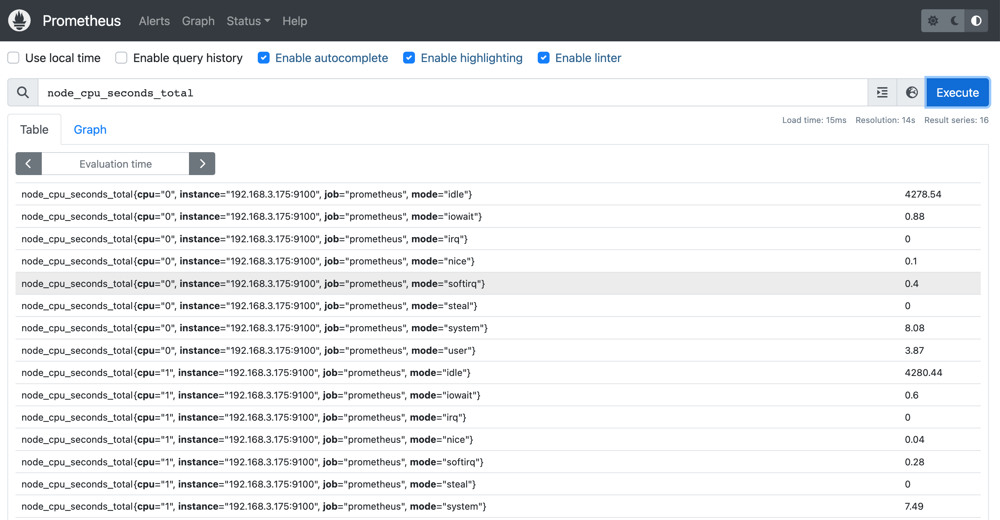

# Prometheus

## metrics类型
HELP:说明

TYPE : metrics类型
```text
alertmanager, alects, invalid., total(version= "v1"@139383232 0
```
Histogram参考文档[link](https://www.cnblogs.com/ryanyangcs/p/11309373.html)

## PromQL

瞬时向量:包含该时间序列中最新的一个样本值

区间向量:一段时间范围内的数据

Offset :查看多少分钟之前的数据offset 30m
Labelsets: 
* 辻濾出具有handler="/login"的label 的数据。
* 正则匹配 : http_request_totạl{handler= ~"*login.*"}
* 剔除某个lable: http_request_totạl{handler!=".*login.*"}
* 匹配两个值 : http_request_totạl{handler=~"/login|/password"}

数学运算: +-*/% ^心

查看主机内存总大小(Mi)心

BMit : mode_memery_MemTotal_bytes 11024 /1024

mode_memery_MemTotal_bytes/ 1024 /1024 < 3000

结合运算:
* and or
* mode_memery_MemTotal_bytes/ 1024 /1024 <= 2772 or mode_memery_MemTotal_bytes / 1024 /1024 == 3758.59765625

unless :排除
* mode_memery_MemTotal_bytes/1024/1024 >= 2772 unless mode_memery_MemTotal_bytes/1024/1024 == 3758.59765625

运算符优先级
```text
^
*/%
+ -
==,!=,<=,< >= >
and unless
or
```

聚合操作:
* sum(mode_memery_MemTotal_bytes) / 1024^2求和
* 根据某个字段迸行統汁sum(http_request_totạl) by (statuscode, handler)
* min(mode_memery_MemTotal_bytes) 最小值max 
* avg(mode_memery_MemTotal_bytes) 平均值avg
* 标准差: stdde
* 标准差异: stdvar 
* count(http_request_totạl) 计数。
* count_values("count", mode_memery_MemTotal_bytes)对 value进行统计计数
* topk(5, sum(http_request_totạl) by (statuscode, handler))取前N条时序
* bottomk(3, sum(http_request_totạl) by (statuscode, handler))取后N条时序
* 取当前数据的中位数guantile(0.5, http_request_totạl)

内置函数
* 一个指标的增长率 `increase`
  * increate(http_request_total[1h]/3600)
* `rate` rate(http_request_total[1h])
* `irate` 瞬时增长率，取最后两个数据进行计算
  * 不适合做需要长期趋势或者在告警规则中使用
  * rate适合

预测统计
* `predict_linear` predict_linear(node_fliesystem_flies_free{mountpoint="/"}[1d],4*3600) < 0 根据一天的数据，预测4小时之后，磁盘分区的空间会不会小于0
* `absent` 如果样本数据不为空则返回no data 如果为空则返回1

去除小数点
* `ceil` 四舍五入，向上取整 2.79 -> 3
* `floor` 向下取 2.79->2

`delta` 差值

排序
* `sort` 正序
* `sort_desc` 倒序

`lable_join`: 将数据中的一个或多个label的值赋值给一个label
`label_replace`: 根据数据汇总的某个label值，进行正则匹配，然后赋值给新label并添加到数据中

## 样例
* graph查询node cpu时间源数据
  


* 使用promQL计算cpu使用率
```promQL
(1-((sum(increase(node_cpu_seconds_total{mode="idle"}[1m])) by (instance)) /sum(increase(node_cpu_seconds_total[1m])) by (instance))) * 100
```

