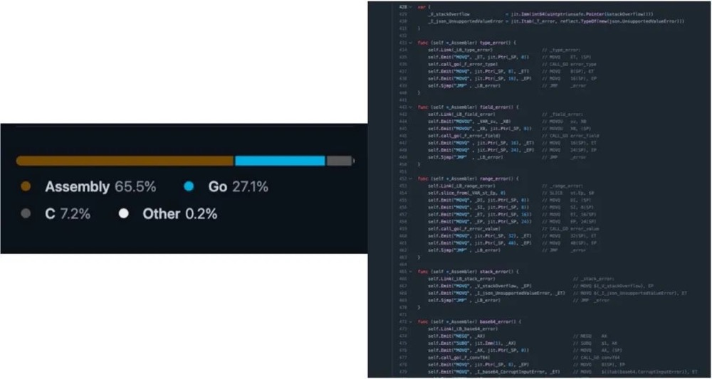

# 博文

* cloudwego微信公众号发的一遍文章，很有意思的一篇，所以记录下来

# 字节跳动在 Rust 微服务方向的探索和实践

## 01/嘉宾及内容介绍

本次分享内容主要分为以下三个部分：

1、我们为什么选择了 Rust 语言；

2、我们做了什么；

3、展望未来：机遇与挑战。

## 02/我们为什么选择了Rust语言
 我会为大家主要介绍一下我们为什么会选择 Rust 语言，因为大家可能听说字节跳动比较有名的框架叫做 Kitex，是一个 Go 的框架，字节跳动在 Go 方向投入了很多，为何现在开始探索 Rust 方向呢？其次，在这个方向我们做了哪些事情，遇到的一些问题，以及我们的解决方案。其三，会为大家分享一下我们所认为目前 Rust 的机遇以及未来挑战。

一开始，我是做 Go 的语言开发，做 Go 的 RPC 框架，但当时我们遇到了很多 Go 语言的一些问题。

### Go 语言的桎梏
* 深度优化困难

在 Go 里面，你想要深度优化是非常非常困难的一件事情，因为当我们体量变得越来越大的时候，深度优化是越来越重要了。但是如果在 Go 里面，想要去做一些深度优化，你经常会发现在跟 runtime 以及编译器做很多斗争，需要用一些很 hack 的办法去绕过它的一些限制。

* 工具链和包管理不够成熟

Go 里面的工具链和包管理相对来说不太成熟，如果有用过我们开源的 Kitex 框架的同学可能会非常了解。举个例子，比如在 Go 里面，想调一个 gRPC 的服务，或调一个 Thrift 的服务，需要调一个需要生成代码的服务，我需要先在开发的时候把代码生成好，要用一个命令行工具生成完之后，把生成代码一并地给提交到版本管理里面。直白来说，这是个很蠢的做法，像 C++、Java，还有 Python 也许都会采用一些其他的方案，但是 Go 就必须这么操作，因为它编译器就没有这个能力，没有办法在编译时去生成这个东西。还有一点，比如我在编译时也许可以调个脚本去生成，但问题在于本地没有这个文件，代码生成、代码补全提示都没有， IDE 会直接给你里面所有的就下划线飘红，这是个体验很差的事情。

* 抽象能力较弱

Go 里面的抽象能力是比较弱的，它没有零成本抽象这么个概念。

那么使用 Go 语言的三个桎梏具体应该如何理解呢？下面进行具体分析。

#### 深度优化困难

我分享一个之前遇到的真实、有意思的案例。我们做序列化、反序列化的过程当中，可能会遇到一些出错的情况。在我们之前的版本里面，代码是很简单的，在序列化、反序列化出错的时候，就直接把 error 返回来。后来我们为了优化用户的体验，想多返回一些错误信息，比如我们告诉他是在哪个 struct 里面，在 read 哪一个字段的时候出的错。这是一个很好的初衷，但是当我们新的代码上线了之后，有一个业务方就跑来说：“你这个新的代码是不是有问题？为什么我们的性能下降了20%？”我们认为不可能，我们所有序列化、反序列化逻辑都没有改，只改了这一行。当时我们也很纳闷，认为是不是业务方自己测试环境有问题，后来我们查了半天，最后终于发现了情况。

Kitex新版本代码

Kitex 旧版本代码

大家可以看到这个是新的代码生成出来的汇编，在 Go 里面它的汇编生成或编译器，应该说非常非常不智能，它没有做一些像代码位置上的调整，或者没有做这种代码的指令的重排，就导致了比如我们刚才看到的 error 的错误信息，他直接把所有的错误信息或这些字符串全部插入到了正常的流程当中。带来了什么问题？带来了我们的 L1 的 cache miss 的大量提高，因为 L1 的 cache 是会很大程度上影响到我们的执行性能、运行性能，所以就导致了性能的下降。

如何解决这个问题？你们可能会认为，编译器的问题是不是无法解决。后来我们用了个非常 hack 的办法，既然编译器不会去做代码重排，我们就只能自己做。我们自己把所有的错误都定义到了正常 return 语句的后面，在出错的时候用 Go to 跳转到后面，跳转到 label 上。大家可能在写代码或者学的时候都会听说过说 Goto 要慎用，尽量别用。但是在这种场景下，我们只能这么做。这个时候 Goto 语句被直接编译的时候，生成一条汇编的 jmp 指令，最后测出来的性能比之前的旧的版本即直接 return error 还要好。因为它的 cache 的 miss 直接从大概之前的 2.4 降到了现在的 1.8，又提升了很多。

#### 零成本抽象

还有一个就是在 Go 里面其实没有零成本抽象概念。零成本抽象的意思就是，如果我们没有用到的东西，是不需要为之付出代价的；而如果我们用到的东西，不管是编译器、标准库还是第三方库的提供者，都应该是做到最好的，不可能做得更好。可能写 C++，还有写 Rust 的同学比较了解这个概念，但是在 Go 里面是没有的。总结来说：
* 不用的东西，不需要为之付出代价；
* 用到的东西，你也不可能做得更好。

#### Thrift 编解码抽象

而为什么说 Go 里面没有零成本抽象概念，举个例子，我们做Thrift 的编解码抽象，那么 Apache 官方的 Thrift，是支持很多种不同的 Transport 和 Protocol 组合。底层传输层，还有上层的序列化层，它其实是有很多不同的协议的，比如 transport 层，有个叫 framed 的transport，有个叫 buffered 的transport，甚至还有一些像 memory 直接在内存里面。 除了 transport 还有 protocol，现在基本上是两种：Binary 和 Compact。大家知道，它有多种不同的组合。官方实现它为了去支持多种不同的这样的组合，用了 Go 里面的 interface 去做了抽象，但是我们后面把抽象给去掉了，我们直接依赖了一个具体的 protocol 的实现，也就是依赖了一个具体的 struct。

#### Interface 的代价
那么为什么我们不用它的抽象？因为抽象是有代价的。代价就是在 Go 里面，它的 interface 是动态分发的，即运行时通过类型的元数据和指针，去动态调用所需接口，它可能会造成多一次的内存寻址。
但这并非最主要的，最主要是它会影响到 inline。而且在 Go 里面没有提供一种零成本抽象的方案，它不像 Rust 里面有一个 box dyn，与 interface 很像。还有一种是静态编译式的，做静态分发，在编译的时候直接把类型给单例化出来了，这就是一个零成本的，但是 Go 里面没有。

#### Sonic
还有一个项目其实是非常有意思的，我们 CloudWeGo 社区开源了一个叫做 Sonic 的项目，应该是在 Go 里面最快的 JSON 的序列化、反序列化的这么一个项目。这个项目为什么快？因为它的秘诀就是世界上最快的 Go 代码，不要用Go 写，直接用汇编和 C 写就完事了。大家可以看 Github 上面代码语言的统计，实际上 Go 占 27.1%。

大家会发现其实所有的 Go 的代码里面，基本上也是通过 Go 去生成汇编。所以这就是我们的结论，世界上最快的 Go代码，不要用 Go 写，用汇编写就完事了。

#### 性能最好的 Go JSON 库
但尽管 JSON 库用了非常多的黑科技去优化，但是我们可以看到，绿色的这一条是 Rust 里面比较经典的，叫 serde 库。serde JSON 这个库就是 benchmark 的结果，我们做 benchmark 发现它还是比不过这个 rust 的库。所以我们后面下定决心，想要去研究一下 Rust 方向，去尝试一下落地。

#### Rust 的历史
讲到 Rust 这个方向的语言，肯定要了解一下它的历史。Rust 一开始是由一个名叫 Graydon 的人开发出来的，他是一个 Mozilla 的职业的编程语言的工程师。Mozilla 当时想要去实现一个叫 Servo 的一个引擎，觉得这个语言很有价值，决定去使用它去赞助了这个语言。

在 2015 年的时候， Rust 发布了 1.0 的版本。1.0 版本其实就代表了一个稳定性的承诺。在 2018 年发布了 1.31 版本，1.31 版本代表的是生产力。在 edition 2018 时候引入了 Async await 异步的 Rust，在现在来看，我给他的评价是未来可期。

#### Rust 2024
Rust 在 2024 有一个规划叫做 scaling empowerment，也就是扩展授权。为什么叫扩展授权？因为这就是我在专场一开始问大家的问题，说 Rust 的目标、愿景是什么？它的愿景是 empower everyone to build reliable and efficient software，所以它要授权每个人去创造可靠并且高效的软件。

在 2024 的规划里面，因为其实大家也都听说过 Rust 的学习曲线比较陡峭， 目前 Rust 官方其实也已经了解到了一些特别是 async 的 Rust 存在一些使用上的问题，并且也非常重视这个事情。所以它 2024 年的目标主要就是为了让 Rust 更加好用，更加易用，并且能够落地更多的项目。
#### Rust 三大优势
Rust 在我们看来有三大优势：性能、安全、协作。性能和安全可能大家都会比较了解，或者会听得比较多一些。
* 性能
  
比如这是一个 debian 搞的 benchmark game 的一个结果，我选的是一个纯计算的 case 的结果。在里面可以看到， Rust 语言其实是遥遥领先其他几个语言，特别是 Go 的，大概有 4 倍的提升。

* 安全性
其实在网上有很多相关的资料，我也不过多赘述。我只讲最重要的一个结论，就是在 Rust 1.0 之后，在非 unsafe 代码中不可能出现内存安全的问题。

这个结论可能大家听起来觉得有点云里雾里，其实它的一个推论更加重要，就是一切的内存和并发安全问题都是unsafe 代码导致的。这就直接表示，如果在线上一个服务出现了 coredump，或者出现一些内存安全并发安全的问题，不用去看 safe 代码，直接看 unsafe 代码就好。 因为 Rust 里面 unsafe 代码是非常少量的，它不像 C 和C++，可以说全都是 unsafe，如果去找可能不知道要找到何年何月。但是在 Rust 里面，只要去看变更中新增加了哪些 unsafe 的代码，这些代码肯定就是问题的源泉，这就是 Rust 的安全性所带来的好处。

* 协作
我认为 Rust 非常适合协作，是因为它确实是一门真正工程实践出来的语言。它有非常智能的编译器，有完善的文档，有非常齐全的工具链，以及成熟的包管理。而且最重要的一点，你可以完全信任别人的代码，这个是在 C 和 C++ 甚至在 Go 里面都做不到的。

如果有同学有 review 过其他团队成员的 C 或 C++ 代码的经验或体验，应该能了解到，当你 review 这种 C 和 C++ 代码的时候，很多程度上根本看不出来它到底哪里会搞了个什么野指针出来，或搞了个内存安全问题出来，只有在线上真正 coredown 的时候，而且 coredown 的地方很可能是在十万八千里之外，你根本联想不到是这段代码导致的。因此很多时候没有办法去信任别人代码。但是在 Rust 里面没有关系，只要它能编译过它，代码就是安全的。所以我们在 review 的时候，只需要去关注那些业务的逻辑是否正确就可以了。

#### Rust 开发者调研

在 Stack Overflow 上，每年都会有开发者调研。Rust 已经连续七年成为最受欢迎的语言，而且可以看到它离第二的差距挺明显。

#### 业界的应用案例

我也简单介绍一下在业界上有哪些应用案例，因为一个语言除了在社区应用的比较广之外，被企业接受也是一个很重要的指标。首先在 Meta （Facebook）接受 ，它已经是一个后端正式的支持语言。在我们公司字节跳动，在很多场景上也已经用到了Rust，特别是飞书。如果有用过飞书的企业可以了解一下，飞书所有的逻辑全都是 Rust 编写的，在 Google 、蚂蚁金服还有下面有很多的企业。

#### Rust for Linux
Rust 的应用在最近也是越来越广。还有一个很重量级的项目叫做 Rust for Linux，这个是 Linux 内核至今为止，唯一接受的除了 C 以外语言，应该是相当重量级的一个代表。
#### 和 C++、Go 对比
我再简单做一个 C 和  C++ 和 Go 的对比。我觉得学习难度上 C++ 和 Rust 都是高，性能上 C++ 和 Rust 也都是高。但是安全性上面， Rust 其实是完爆这两个其他语言的，特别是在协作上。正如之前提到过的，对于 C++ 来说没有一个原生的包管理工具，同时它也没有办法让你去信任别人的代码。 使用成本上面，我综合认为 C++ 使用成本比较高， Go 和 Rust 使用成本都是中等。为什么说 Rust 使用成本是中等？因为使用成本不仅仅是开发的时候所要付出的成本，它还涉及到一个服务要上线之后，要让它进入到稳定状态中间的 debug 所需要的成本，以及你如果出事故所带来的一些损失，这些都是要考量在内的。综合下来，我认为 Rust 它的使用成本是中等。

这里又有一个问题了，为什么 Rust 这么好？它和 C++ 是同一个 level 的语言，为什么 C++ 做不到这么好？当然，其实我们都说软件工程里面没有银弹，这是因为 C++ 的历史包袱确实太多了。 Rust 胜在没有历史包袱，所以它设计的时候就不像 C++ 必须要兼容那种旧的使用模式。不能说更新个 C++21，旧的代码全都编译不过，那么大家谁愿意做呢。 Rust 其实有点占了这方面优势。

## 03 我们做了什么
#### 公司内（之前）生态情况

接下来我为大家介绍一下，我们字节跳动做了些什么。这是一个很悲伤的故事、很悲伤的数字。在我们开始做的时候，其实公司内的生态是 0，服务端什么都没有，什么都要自己开始建。
#### 如何建立生态

当时考虑这个问题，首先是得让大家能用起来，这就涉及到了一些编译打包和运行的基础设施。我相信每个公司都会有自己的编译打包流程、上线的流程以及运行的环境。这些是比较关键的一些设施，包括内网的一些像 crates.io 还有 docs.rs 这些开发所需要的基础设施，以及一些基础库和开发框架。 可能每个公司的环境不一样，我介绍的是一个大概的流程，这个流程如果有公司想要去尝试，是可以一起来参考一下的。
#### 基础库

基础库大概是像日志、监控、链路追踪、mysql、 redis 、动态配置、 mq 这些属于我们认为非必须的、非常重要的一些基础库。这些可能是需要推广方，比如我们团队是作为推广方，去把这些全部建设起来。

接下来剩下一些非必须的基础库，可能是某一些业务单独的库，就可以发动群众的力量，因为它只要最基础的这些东西。比如它能够完成一个 CRUD 的基础服务，剩下的东西可以一边在开发业务过程当中，一边自己去写。
#### 开发框架

我们也准备了 3 个开发的框架：

第一个，基于 Axum 的 Web 框架。 Axum 算是 tokio 现在比较火的一个官方的 HTTP 的 Web 框架。

第二个，RPC 框架，支持了 GRPC 和 thrift，叫做 Volo。已经开源在 CloudWeGo 的组织下面了，如果之后有 RPC 的需求可以直接来使用这个框架。

第三个，异步的运行时的 Monoio 框架。这个主要是考虑到提供给一些性能非常关键的业务以及基础设施，就是基础架构的服务去使用。它的好处在于它采用 Thread Per Core 模型，这样就可以解决 Tokio 的很多问题，比如它的 future 必须加 Sync 的一个问题。因为 thread per core 的情况之下，它能保证一个 task 一定在一个线程中被运行，这样很多时候就不需要 send 加 sync 的约束，可以直接用 TLS（ thread local storage ）或者其他的这些技术，以及一些无锁的技术去编程，这可以很大程度上提高性能。第二个就是它采用了 Linux 最新发布的 io_uring 技术去做 IO 层 ，如果有对于性能要求非常高的同学可以去了解一下。
#### 发现的问题

我们当时毕竟是吃螃蟹，肯定也遇到了一些问题。我们主要遇到开源库的 bug，以及开源库不完全满足需求的问题。比如最近我们就遇到了一个业务，它在使用的是 Snappy 库，做压缩和解压缩的库。他发现压缩和解压缩的 writer 他是不能复用的，我们后面就自己给他提了 PR 去支持上了。
所以在吃螃蟹这个阶段，可能需要能够自己去解决问题，要去提 PR，以及要自己 Fork 一些开源库出来去用的。这个要做好心理准备，因为这是我们真正实践上遇到的问题。还有一个可能跟技术没有特别强关联的问题：我们发现有很多一线的同学其实特别喜欢 Rust、特别想用 Rust。正如刚才提到， Rust 是 stuck workflow 上最受开发者喜爱的语言榜榜首，已经连续第 7 年。但是很多的 leader 管理者会担心，我们团队只有一个人会 Rust，如果这个人他转岗了或离职了，这个服务是不是就没有办法维护了？这可能是很多的 leader 会担心的问题。
#### 如何推动落地

这时其实就需要我们作为推广方去介入，并且去帮助他去开发一些项目。这个时候可能不会让他去开发一个业务的服务，因为业务服务毕竟有时需要整组一起讨论、一起拍板之后才能选择某个技术站，但是个人的项目是可以用的。

很多对 Rust 非常感兴趣的的工程师，只是缺少有一个人带头，或者缺少一个契机。最重要的一点就是要寻找一些典型的业务去共同地开发、去获得收益。在我们看来，这些典型的业务有一个特征，就是 proxy 的业务，它是一个代理类的业务，重计算，但是逻辑是比较简单的，因此虽然我们在推动落地时需要一些前期投入，但是是值得的。

#### 实践：nightly + GAT + TAIT

具体的收益稍后为大家分享。这里我先介绍一下我们一些实践中的感悟。不要视 nightly 为洪水猛兽，nightly 是真香。nightly 有很多很多的特性是非常棒的，比如像刚稳定的 GAT，还有 TAIT。这两个特性是能大大的去降低推广 Rust 的阻力。
#### 一个 Timeout 中间件

我们可以看一下对比是在没有 TAIT 情况之下，也就是 tower。可能写 Rust 的同学都知道有 tower 这么一个中间件抽象的库，这里大家不管会不会 Rust，可以不去过多地关注它的细节。大概看一下在 tower 里面，我想要没有成本也没有性能损耗的去实现一个 Timeout 的超时中间件，需要满满两屏的代码。

但是如果用我们的采用了 GAT 加 TAIT 这两个特性之后，代码量只需要这么多，这其实是一个非常明显的对比。其实我们很早就开始用了。

所以在实际推广的时候，可以去考虑把这些有用的特性都给打开。特别是有一个特性叫 async fn in trait，在 trait 里面可以定义异步函数了。这个特性已经在 nightly 上达到了MVP，虽然存在一些问题，但起码是可用的状态了。

#### 落地成果

接下来为大家介绍一下我们的落地的一些成果。首先是有一个 proxy 类的业务，它的 CPU 的占用从大概 630% 降低到了380%，几乎是提升了一倍。第二个就是它的memory，也就是它的内存占用大概从 9GB 降到了 2GB。然后它的 P99 和 AVG 也有非常大量的提升了。
1. 业务 A（Proxy 类）
CPU Usage 630% -> 380%
MEM 9GB -> 2GB
P99 150-200ms -> 20-35ms
AVG 4-5ms -> 1.5ms
2. 业务 B（有大量业务逻辑）
CPU 400% -> 130%
3. 业务 C（有大量业务逻辑）
CPU-50% ，MEM-95%

2. 业务 B（有大量业务逻辑）。业务 B 是一个计算密集型的业务，使用 Volo 框架后 CPU 400% -> 130%。因此在计算密集型的业务中，CPU 的提升更加明显。
可以看到左边这张图，红线这条线是我们上线的时间点，在之前和之后，它的尖刺有很明显的对比。另外一个业务b，有大量的业务逻辑，它大概是 CPU 占用从 400% 降到了130%，大概三倍的提升。另外一个业务 c 也是有很明显的提升。
还有某一个比较重要的线上业务，它的提升量也是非常明显。举个例子，它的成本是降低了50%。大家就会问：这些数据能证明什么、代表什么？我光知道好， CPU 降低了， memory 降低了， ABG 降低了，延迟降低了，它能说明什么？我们来简单地算一下。
4. 业务D（线上重要业务）
吞吐+95.96%
成本-48.97%
avg -14.29%
P99 -18.18%
P999 -10.26%

#### 算一算

这是某云的一个价格截图，64核 128G 的机器，一个月的价格是6262元。因为某云买 5 年可以打 3 折，所以我就按照最优惠的方案给大家算。28000一年，相当于算下来是 437 元/ CPU *年。业务使用了 1 万个核心，我们刚才计算下来成本减去了48.97%，我就按 50% 算，节省 5000核 ，相当于一年节省的数量就是 200 多万。这就是一年省下来成本。

我们又有同学会说了，你没把开发的人力算上。我再把开发的人力给算上，已经是一个非常非常高的，几乎不可能达到的一个开发的成本了。因为我们服务大概就花了大概两三个月，写完就重构完了，我就算 6 个月，开发的加办公的成本，我也选了一个非常非常高的值，其实应该是达不到这个值的。假如他是 120 万，他第一年的净收益就是接近 100 万，再往后每一年都是纯收益了，已经没有成本了。当然实际上它的收益应该是远不止这个值的，因为 CPU 成本是没有这么便宜的。

有做过成本核算、效益核算的同学，可能会比较了解一些它的成本的值。一个经验值大概是在 1000 一核，可以按照这个值去计算。因为除了 CPU 单纯的 CPU 价格之外，还有网络的成本，比如机房运维人员的成本，其实成本是远不止 437 一个 CPU 的。还有一点，如果AVG，也就是 latency 延迟有降低的情况之下，其实是能够带动业务的增长的。 

## 04 展望未来：机遇和挑战
### Rust 现状
Rust 现在的现状：好用。它确实挺好用，它的功能很多，很符合人体工程学，但是它还不够好用。

其次，它的抽象能力、表达能力是挺强的，但是它的高阶抽象还有些问题，特别是写 Rust。可能用过 HRTB 的同学会知道， HRTB 配合 GAT 或和 TAIT 使用的时候会有些坑，但是使用场景实在太高阶，基本上业务开发是用不到的，所以也可以接受。 第三， Rust 的异步生态现在较为完善，但是它和同步的生态存在一些割裂。比如一个函数 Fn，它不能同时是异步和同步的，异步版本和同步版本必须写两个不同的函数。

当然，其实 Rust 官方也已经感受到了这些问题，都在解决，特别在 2024 的 roadmap 里面都有提到这些问题。像 Niko 也在尝试一个新的方案，它希望一个函数可以同时是 async 以及 sync 的两个版本。如果调用方是 async，它就会调一个 async 的，在编译时生成一个 async 的实现。他会做这样的一件事情。
还有一些比较好的消息是开发者非常喜爱，用户的忠诚度是非常高的。我相信写出来的同学应该不会再考虑转到转回到其他语言去了，起码我是不会再回去写 go 了。开源项目也是爆炸性的增长，特别是这两年，可以明显感觉到越来越多的开源项目采用 Rust 。不管是新增项目还是重构的项目，有越来越多的公司接受开始使用 Rust。
### Rust 应用的方向

Rust 其实它的应用的方向非常非常的广，我大概简单列了一下，包括像 Rust for Linux 其实已经相当于补足了。Rust 应用的最后一块拼图，也就是 OS 层和嵌入式层，都是可以使用 Rust 去写的。还有一个最近很有名很火的一个方向，就是 WebAssembly，基本上 Rust 也属于是第一梯队的，就是最佳的语言了。
面临的挑战

目前面临的一些哪些挑战，第一个是 Rust 的职位不够多，人才不够多，其实是一个相互的关系，如果人才多起来，职位也会多。如果职位多，人才也会多。所以这可能需要的不仅是某一家公司去投入做什么，而是希望所有喜爱 Rust 的程序员，共同地一起去把整个生态建设起来。

第二是 Rust 在中国的名声不够响，虽然现在已经在慢慢地提升当中了，但是它和 Go 确实还有一些的名气上的差距，通过培训班的数量就能看得出来。

第三是 Rust 缺少像 K8S 一样的杀手机应用。这也是大家一直提到的一点，下面是 Rust 官方做的调研的一个图，有 22.51% 的人认为 Rust 是 for the majority of my coding，他们大部分的主要代码都是用 Rust 写的。有17 %的人说是自己所有使用的语言中之一，有 18% 的人说他只是偶尔去使用。但是这张图其实就说明了 Rust 语言它是否真的能够产生价值。

再下面这张图是 Rust 官方来问，你觉得 Rust 语言有没有帮助你真的去实现一些什么东西？有 80% 的人认为 Rust has helped us achieve our goal ，Rust 已经帮助我们达到了我们的目标。但是有一个坏消息是 47% 的人认为用 Rust 是 challenge 的，是有挑战性的。后面有70%。有 80% 的人认为 Rust 是值得我们的付出的，以及有 90% 的人认为我们在未来还愿意去使用 Rust。

### 机遇

现在我们还遇到了一个新的机遇，降本增效，以及现在其实大家都对底层技术越来越关注，而 Rust 它的掌控力非常的强，所以在底层技术领域它是一个非常非常趁手的工具。而且现在 Rust 关注度足够高，社区也是在快速发展的过程当中。
### 拥抱开源，回馈社区

我们在公司内部也建设了很多的，投入了很大量的时间精力去开发了一些相关的这样的基础设施。我们也是取之开源，用之开源。我们把我们最核心能力全部都暴露了出来。一个 Volo 是我们的 RPC 框架，如果有使用有微服务的框架需求的同学或公司，可以考虑使用一下。 

Monoio 刚才已经介绍过了，是一个 Thread Per Core 模型的，使用了 io_uring 的一个超高性能的异步框架。我们也出了一个对标 tower 的中间件的抽象，就是 Motore 直接使用了 GAT 加 TAIT 这两个重要的特性。以及为了解决一些国内众所周知的网络问题，我们也做了一个 proxy 给大家，大家如果经常遇到拉包拉不下来的问题，也可以考虑使用一下。

* Volo：https://github.com/cloudweGo/volo
* Monoio：https://github.com/bytedance/monoio
* Motore：https://github.com/cloudweGo/motore
* RsProxy：https://rsproxy.cn/
项目地址

-----

GitHub：https://github.com/cloudwego

官网：www.cloudwego.io

