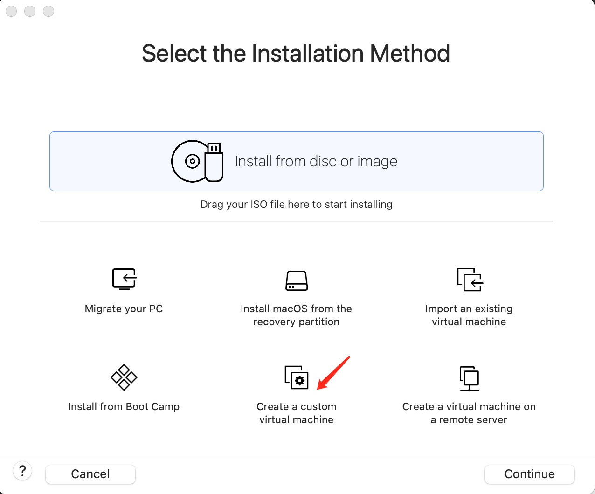
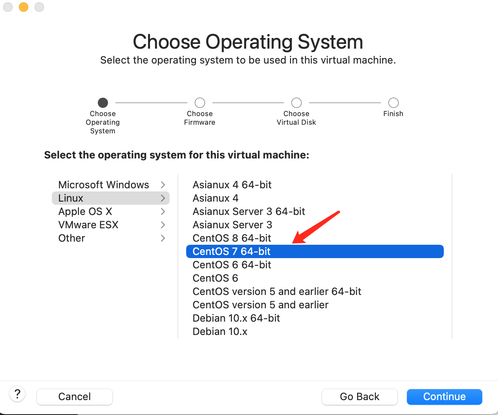
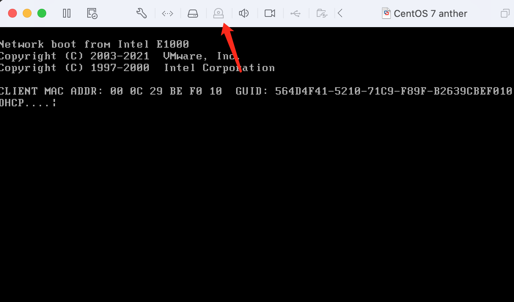
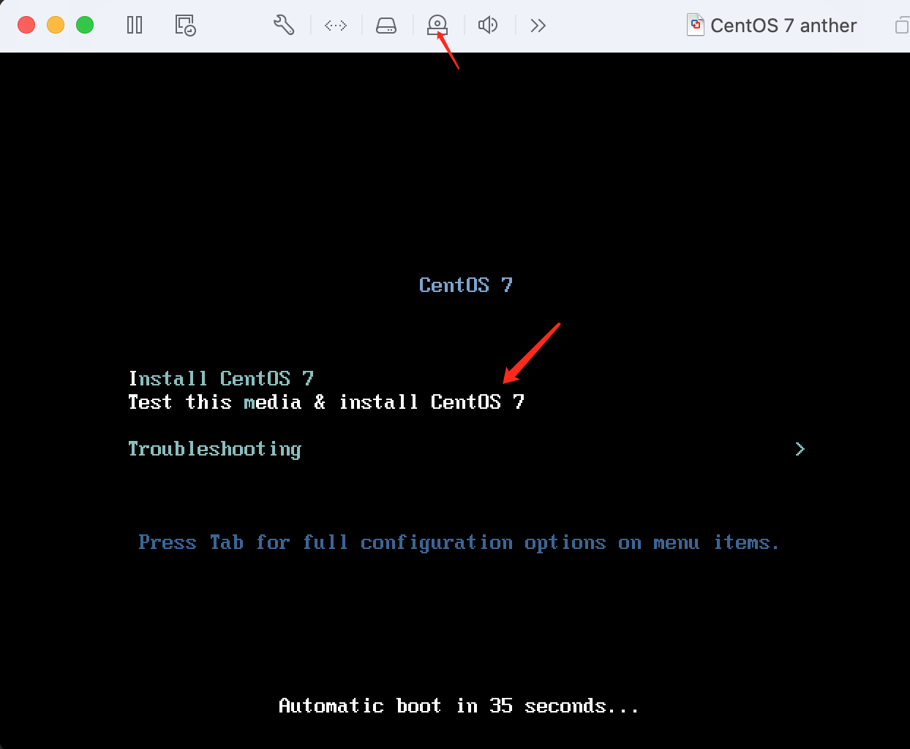
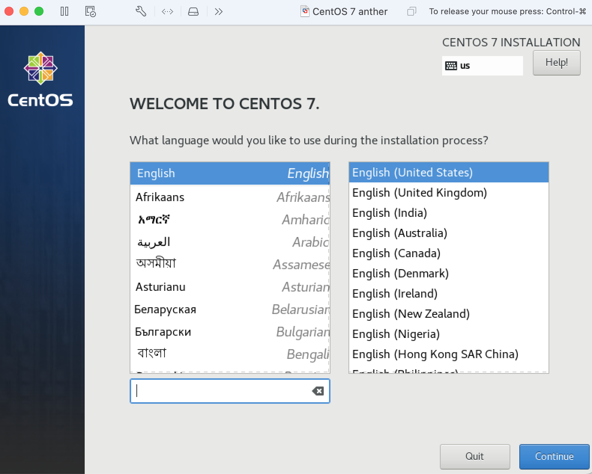
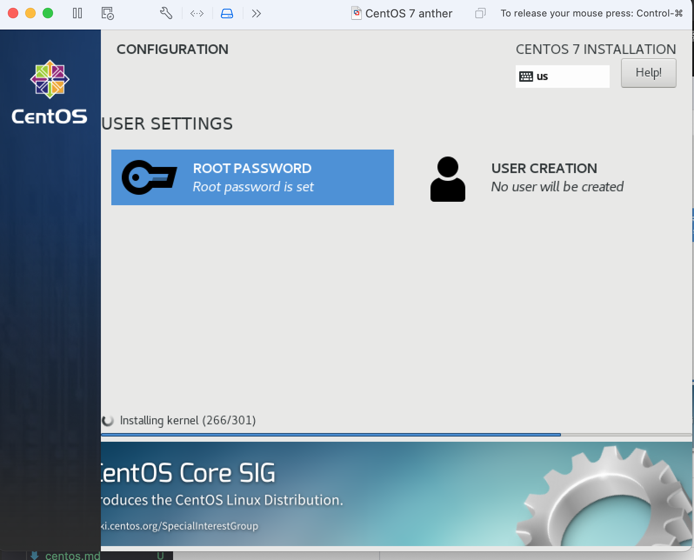
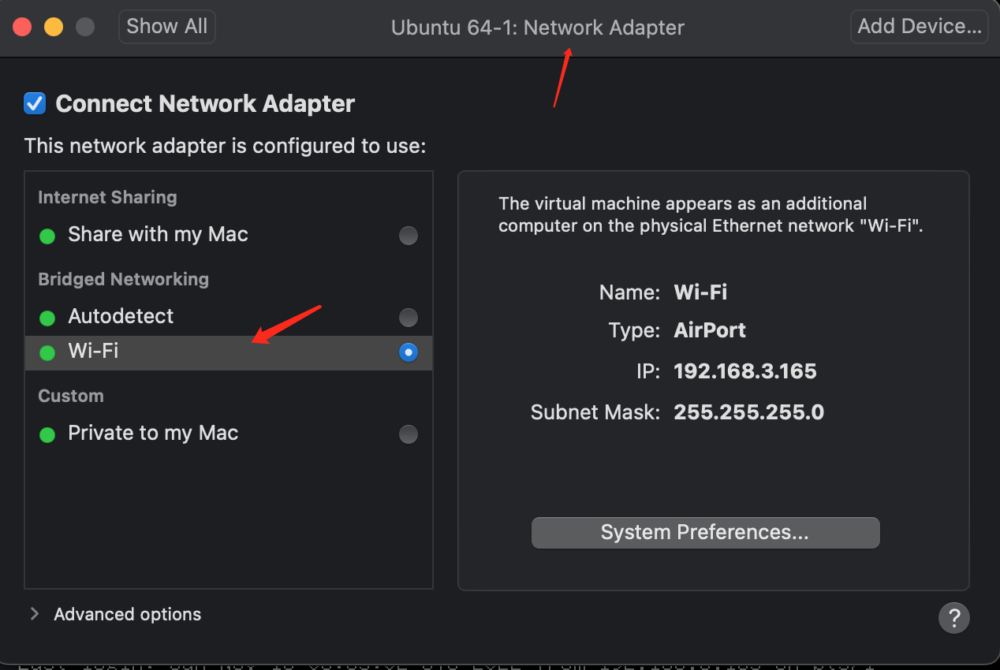

## VMware 安装 CentOS

### 镜像下载

- 地址 https://mirrors.aliyun.com/centos/7/isos/x86_64/
- 选择，下面两个中的其中一个

```text
CentOS-7-x86_64-Minimal-2009.iso	973.0 MB	2020-11-03 22:55
CentOS-7-x86_64-Minimal-2009.torrent	38.6 KB	2020-11-06 22:44
```

### 安装

1. 第一步选择创建虚拟机



2. 第二步选择系统
   

3. 第三步选择光盘和镜像
   

4. 第四步弹出安装启动程序
   

5. 第五步 language 选择界面
   

> _Warning_ 这里出现此界面，卡住了半天，因为这里必须使用 Tab 键才能真正选择到对应的 button，要不然怎么滑动鼠标，点击 enter 都无济于事，苍了个天！~~！！~

6. 第六步选择安装磁盘，设置密码，开始安装流程
   

### 登录并且设置环境

1. 第一步修改网络为桥接形式
   
2. 修改 network 配置文件

```ini
[root@localhost ~]# cat /etc/sysconfig/network-scripts/ifcfg-ens33
TYPE=Ethernet
PROXY_METHOD=none
BROWSER_ONLY=no
#BOOTPROTO=dhcp
DEFROUTE=yes
IPV4_FAILURE_FATAL=no
IPV6INIT=yes
IPV6_AUTOCONF=yes
IPV6_DEFROUTE=yes
IPV6_FAILURE_FATAL=no
IPV6_ADDR_GEN_MODE=stable-privacy
NAME=ens33
UUID=8b88ccf9-ed59-444c-a374-d67dd6f38fe1
DEVICE=ens33
ONBOOT=yes
IPADDR=192.168.3.18
GATEWAY=192.168.3.1
NETMASK=255.255.255.0
DNS1=192.168.3.1
```

3. 重启网络`systemctl restart network`
4. 校验网络连通性

```shell
[root@localhost ~]# ping baidu.com
PING baidu.com (110.242.68.66) 56(84) bytes of data.
64 bytes from 110.242.68.66 (110.242.68.66): icmp_seq=1 ttl=51 time=47.5 ms
64 bytes from 110.242.68.66 (110.242.68.66): icmp_seq=2 ttl=51 time=48.7 ms
64 bytes from 110.242.68.66 (110.242.68.66): icmp_seq=3 ttl=51 time=48.7 ms
```

5. 添加 ssh 免密登录

```shell
[root@localhost .ssh]# ll
total 4
-rw-------. 1 root root 569 Nov 13 08:20 authorized_keys
[root@localhost .ssh]# cat authorized_keys
ssh-rsa AAAAB3NzaC1yc2EAAAADAQABAAABgQDMRuCm
```

6. 校验免密登录
7. 出现`-bash: warning: setlocale: LC_CTYPE: cannot change locale (UTF-8): No such file or directory` 报错

- 解决方案

```shell
vi /etc/environment
add these lines...

LANG=en_US.utf-8
LC_ALL=en_US.utf-8
```

### 配置 CentOS 镜像源

1. 安装 wget

```bash
[root@localhost ~]# yum install wget
Loaded plugins: fastestmirror
Loading mirror speeds from cached hostfile
 * base: mirrors.ustc.edu.cn
 * extras: mirrors.ustc.edu.cn
 * updates: mirrors.ustc.edu.cn
```

2. 备份

```shell
mv /etc/yum.repos.d/CentOS-Base.repo /etc/yum.repos.d/CentOS-Base.repo.backup
```

3. 下载新的 CentOS-Base.repo 到 /etc/yum.repos.d/

```curl
wget -O /etc/yum.repos.d/CentOS-Base.repo https://mirrors.aliyun.com/repo/Centos-7.repo
```

4. Epel 镜像

- 备份(如有配置其他 epel 源)

```shell
mv /etc/yum.repos.d/epel.repo /etc/yum.repos.d/epel.repo.backup
mv /etc/yum.repos.d/epel-testing.repo /etc/yum.repos.d/epel-testing.repo.backup
```

- 下载新 repo 到/etc/yum.repos.d/

```curl
wget -O /etc/yum.repos.d/epel.repo https://mirrors.aliyun.com/repo/epel-7.repo
```
