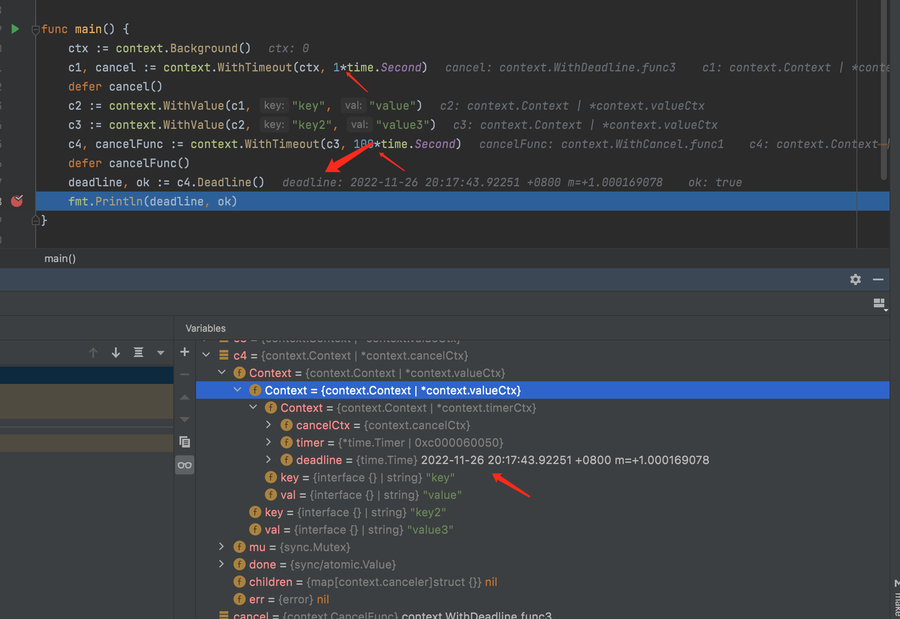
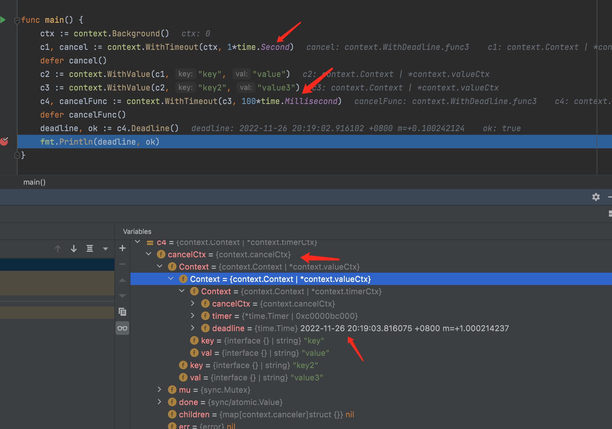
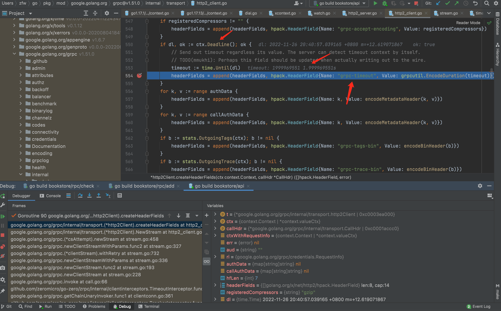

# go context

## context 标准库简介

Go 1.7 标准库引入 context，中文译作“上下文”，准确说它是 goroutine 的上下文，包含 goroutine 的运行状态、环境、现场等信息。

context 主要用来在 goroutine 之间传递上下文信息，包括：取消信号、超时时间、截止时间、k-v 等。

随着 context 包的引入，标准库中很多接口因此加上了 context 参数，例如 database/sql 包。context 几乎成为了并发控制和超时控制的标准做法。

> context.Context 类型的值可以协调多个 groutine 中的代码执行“取消”操作，并且可以存储键值对。最重要的是它是并发安全的。
> 与它协作的 API 都可以由外部控制执行“取消”操作，例如：取消一个 HTTP 请求的执行。

## 疑问一

context时间传递是怎么做到的

再调试[代码](./code/main.go)的时候发现有趣的现象，通过debug之后，发现了端倪





```go
func WithDeadline(parent Context, deadline time.Time) (Context, CancelFunc) {
    if cur, ok := parent.Deadline(); ok && cur.Before(deadline) {
        // 如果父节点 context 的 deadline 早于指定时间。直接构建一个可取消的 context。
        // 原因是一旦父节点超时，自动调用 cancel 函数，子节点也会随之取消。
        // 所以不用单独处理子节点的计时器时间到了之后，自动调用 cancel 函数
        return WithCancel(parent)
    }

    // 构建 timerCtx
    c := &timerCtx{
        cancelCtx: newCancelCtx(parent),
        deadline:  deadline,
    }
    // 挂靠到父节点上
    propagateCancel(parent, c)

    // 计算当前距离 deadline 的时间
    d := time.Until(deadline)
    if d <= 0 {
        // 直接取消
        c.cancel(true, DeadlineExceeded) // deadline has already passed
        return c, func() { c.cancel(true, Canceled) }
    }
    c.mu.Lock()
    defer c.mu.Unlock()
    if c.err == nil {
        // d 时间后，timer 会自动调用 cancel 函数。自动取消
        c.timer = time.AfterFunc(d, func() {
            c.cancel(true, DeadlineExceeded)
        })
    }
    return c, func() { c.cancel(true, Canceled) }
}
```

关键是下面这个判断
```go
if cur, ok := parent.Deadline(); ok && cur.Before(deadline) {
```
这里就是所有这条链上，如果子节点的超时时间大于父节点的超时时间，则不启动定时器，直接使用父节点的。

这里也就解释了golang很多微服务之间，或者就是当前这个服务是怎么处理超时时间的级联控制的。

在服务内好理解

在服务间，如果是grpc的话

debug [book](https://github.com/zzzfwww/bookstore)


api服务调用rpc服务的时候注入`grpc-timeout`信息到`headerFields`

服务端获取超时时间并且写入context
```go
if v := r.Header.Get("grpc-timeout"); v != "" {
		to, err := decodeTimeout(v)
		if err != nil {
			return nil, status.Errorf(codes.Internal, "malformed time-out: %v", err)
		}
		st.timeoutSet = true
		st.timeout = to
	}
```

这样就完美解决了超时时间传递的问题

