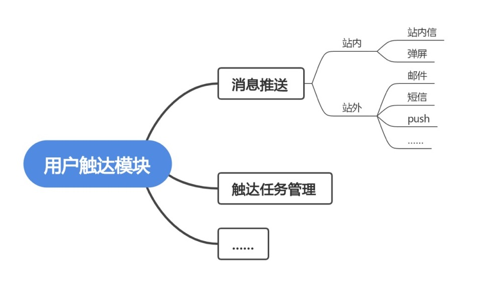
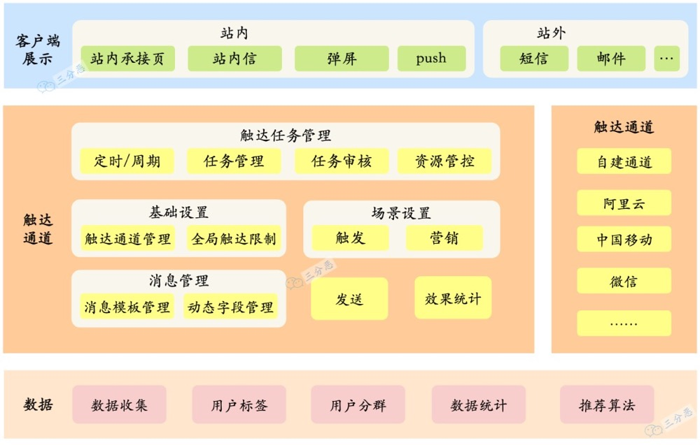
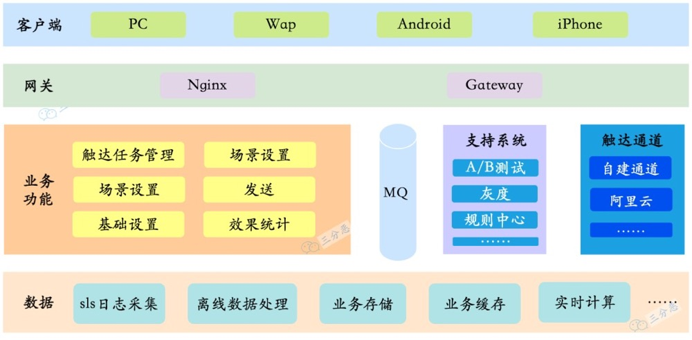
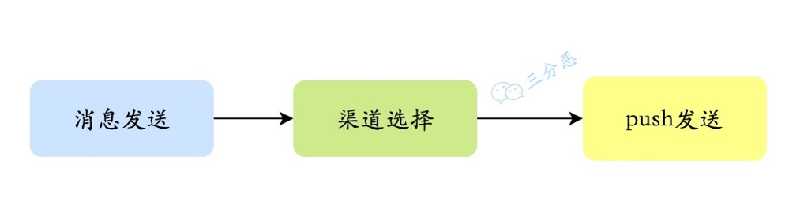
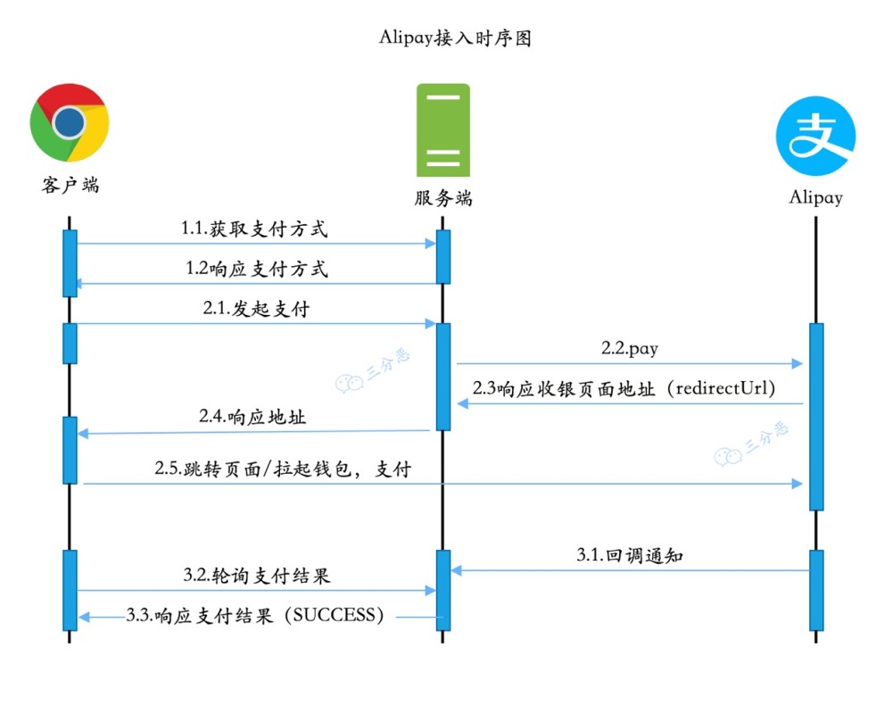

# 模版
技术设计模版

# 一、CRM_技术设计文档_消息触达模块
| 项目名称 |CRM系统|
|---------|--------|
| 项目负责人	 |张三|
| 模块名称	 |用户触达模块|
| 模块负责人 |张三|

> 第一部分主要说明项目或者模块的概况，这一部分虽然不太重要，但是是必须的。

# 二、修订记录
| 版本 |修订人|修订内容| 修订日期|
|---------|--------|--------|--------|
| V1.0	 |张三|创建|2023-01-10|
> 技术设计不是一成不变的，经常会随着业务的变化，或者根据遇到的一些问题，进行完善和优化，但是每一个版本，都应该留下记录和备份。

# 三、需求/背景

产品文档：xxxx

为了实现用户的精细化运营，通过多种途径，向用户发送消息通知……

> 这一部分就是结合产品文档，把需求/背景简单提炼一下，必须，但不是重点。

# 四、设计目标

> 设计目标一般分为两部分：
> * 实现功能：这一部分就是就是分析需求，把产品文档里的东西，拆解成一个个的功能，也就是CRUD。
> * 设计指标：CRUD也有区别，一把梭，随便写也能实现功能，但是我们CRUD也得有点追求，而且面向C端用户的系统，也基本上会有一些性能、可用性之类的要求，比如接口响应平均多少多少毫秒以下、单机QPS1000、系统几个9可用……

## 4.1.实现功能

1. 多种渠道给用户推送消息，主要包含站内和站外两大部分：
    * 站内：
        * 站内信
        * 弹屏
    * 站外：
        * 邮件
        * 短信
        * push
        * 微信
        * ……
2. 触达任务管理
    * 支持定时/延时消息发送
    * 支持触发型消息发送
    * 支持用户分群发送
    * ……
    > 功能点比较多的话，这一部分还可以用思维导图的形式来整理。
   
   

   > 这一部分评审的时候一定要拉上产品经理或者相关的业务方，确定功能点没有错漏。

## 4.2.设计指标
1. 性能要求
   * 百万级消息分钟级发送完成
   * xx接口，性能指标：单机1000并发，95%响应<=200ms

   > 一般C端的服务都是有比较严格的性能要求的，毕竟如果系统响应慢的话，用户的流失率就会变高。当然，用户触达，其实主要在于推，用户主动查会少一些，消息的推送通常也会要求速度，比如，有个网红，九点钟要在app上直播，直播开始的时候，要做一个推送，那就要求尽可能快地把消息推送给每个用户，不能说等到十二点直播完了，有的用户才收到消息。
2. 可用性
   * 触达模块99.9%可用
   * 消息推送成功率80%以上
   
   > C端系统的可用性比较重要，毕竟挂一会，影响的用户可能都是以万计，所以，设计的时候，也要考虑可用性，分析系统的瓶颈在哪里，流量突然上来，哪里可能顶不住，是要扩容，还是要限流、熔断降级……
3. 扩展性
   * 采用策略模式+配置，新增消息渠道，只需少量代码+代码即可实现
   * 引入规则引擎，同一消息类型的不同渠道，可以通过规则调整，无需发版
   > 这一部分也是设计中应当考虑的，不能一味求快，否则很容易堆屎山。
4. 兼容性
   * 接口xxx向前兼容app 1.9.0版本，低版本需强制更新
   
   > C端系统的开发，有时候比较麻的是低版本app的兼容，尽可能早期设计的时候，就考虑可能的扩展，如果实在没法兼容，那就只能app强制更新，当然这种用户体验就非常不好了。
5. 可观测性
   * 接入Prometheus和Grafana，对服务和业务进行监控
     * 服务监控：通过控制面板观察服务的内存、CPU、JVM、接口QPS、接口RT……
     * 业务监控：通过埋点上报，收集用户触达数据，通过面板可以分设备、渠道查看用户触达成功率……
     > 这一部分也很重要，我们一般上班的第一件事，就是看监控面板，分析有没有什么异常的地方。服务的可观测性，一般公司都是用一些开源的或者付费的监控平台，大厂一般都会自研监控平台。服务的监控很多是通过插桩来实现，业务的监控一般都需要打埋点。
6. 告警
   * 通过PrometheusAlert实现服务的告警，告警信息分级别，进行飞书通知、电话通知，告警类型分为服务告警和业务告警
     * 服务告警：内存、CPU占用过高，接口QPS过多，接口RT过长，触发告警
     * 业务告警：用户触达成功率过低告警
     > 告警通常也是和监控在一起的，毕竟开发人员也不可能二十四小时盯着告警，一般开源的、付费的、自建的监控系统，都支持配置告警规则，并通过不同的方式，邮件、短信、电话之类的渠道进行通知。

# 五、概要设计

> 概要设计，就是做个大概的系统整体设计。

## 5.1.设计思路

* 数百万消息段时间发送完成，流量较大，对数据存储性能要求较高，需要选用高性能DB，对存储压力也比较大，同时需要一定削峰处理
* 时/延时消息发送采用消息队列实现，对MQ的消费要求较高，并发度要高，批量消费
* ……
> 这一部分主要是梳理一下整体的开发设计思路，把一些零散的想法梳理成点或者面，前期大家的讨论可以整理在这里。

## 5.2.技术选型

* 存储：TiDB
* 缓存：Redis
* 消息队列：业务RocketMQ，埋点Kafka
* 注册中心：Nacos
* 配置中心：Nacos
* RPC：Dubbo
* 网关：Gateway
* Push通道：自建
> 这一部分就是大概定一下技术选型，其实要是整个项目做好了选型，这一部分也可以不做，一般需要高级技术人员或者架构师，来整体地进行把握，当然，很多时候选型也没好选的，基本就是主流的那些，而且一般一个团队，都是统一的技术选型，方便维护。

## 5.3.业务架构

> 这一部分就是大概对功能分分层，分分块，把大概的功能切一切。

## 5.4.技术架构

> 技术选型+业务架构，其实一个大概的技术架构就出来了。

> 技术架构图类型，其实也没有特别固定的形式，主要是图能达意，我这个图是通过draw.io画的，还有一些其它的还用的工具，比如大家应该都听过“PPT架构师”，用PPT画也是可以的。当然这个图是我随手画的。

## 5.5.系统环境

* JDK版本：11
* 部署环境：k8s+Containerd，单pod8核CPU+4G内存，服务集群32个pod
* 数据库：
  * 业务数据：TiDB 64核CPU+128G内存
  * 离线数据：Hbase……
* ……

> 如果是项目初建，一般还需要对系统的环境进行评估，根据技术选型、数据容量、系统QPS等等，来选择系统的环境，这一部分一般评审的时候会拉上运维同学，提前确定好系统环境，和运维同学对齐需求和排期。

# 六、详细设计

> 详细设计，就是具体指导开发的设计部分了，包括流程啊、数据模型啊、具体用到的算法、和客户端的接口，等等，这一部分很重要，如果没做好，没对齐，那么搞不好就要返工，耽误进度。

## 6.1.流程设计
* push流程

> 用户触达，业务流程基本比较简单，对于一些交易类的，比如支付，或者B端的系统，比如ERP，在开始开发之前，流程一定要梳理清楚，一般通过流程图、时序图来描述业务流程。给大家看一下我之前对接alipay画的简单的时序图：
> 

## 6.2.算法设计
* 渠道分流：同一消息类型，多种渠道，支持按比例分流，采用加权随机算法实现
* ……
> 算法设置不一定数据结构相关的算法，代码里的一些涉及到一些需要进行逻辑计算的，都可以称之为算法，这一部分也可以先梳理一下。

## 6.3.数据模型设计
* crm_user_toutch_tash：用户触达任务表

| 字段 |描述|数据类型|
|---------|--------|--------|
|id	|主键	|bigint|
|task_no	|任务编号	|bigint|
|comment|	描述	|varchar|

> 数据模型设计非常重要，可以说是系统设计的根基，如果没有设计好，开发和维护起来真的很痛苦，每个公司应该都有一定的数据库设计规范，基本就是结合业务和规范来设计了。
>
> 具体用什么工具设计呢？业务比较简单的C端系统，其实直接拿表格也行，之前也试过PdMan，还行吧。

## 6.4.接口设计

|接口名称	|添加支付任务|
|------|-------|
|接口文档地址	|https://yapi.com/xxx|
|入参||
|入参描述|	comment：任务描述|
|出参||
|出参描	||

> 这一部分也是重量级，但凡涉及到客户端，或者其它服务的，这一部分都少不了，一般可以通过YApai之类的接口工具，但是建议大家还是在文档里做个重复工作，把入参出参之类的描述一下，有些地方标标重点，因为有些人真的不怎么会看文档。
> 
> 接口设计的时候一定要和相关的同学对齐，不要怕花时间，后期改接口，是一件很痛苦的事情。

## 6.5.异常处理

* 系统中的不确定异常，进行统一处理，响应“Network Error”
* 埋点异步发送，不影响主要功能
* ……
> 异常处理也是需要考虑的地方，哪些异常可以吞掉降级，哪些没法处理，怎么给客户端展示，怎么打日志，都需要考虑。

# 七、风险评估
> 其实每一次上线都伴随着风险，从设计，一直到上线之前，都要对存在的风险进行评估，上线了要重点观察风险点，也要提前设计好回滚或者处理方案，一旦发现不对劲，及时回滚和处理。

## 7.1.已知风险
* 对数据相关服务压力较大，用户分群、用户画像等数据服务崩溃风险
* MQ存在堆积风险，导致用户收到消息延迟
* QPS较高，数据库CPU飙升风险
* ……

## 7.2.可能风险

* 场景类消息延迟，可能会影响交易相关流程，拉低转化率和成交率
* ……

# 八、测试建议
> 需求评审阶段、设计评审阶段，最好都拉上测试同学，测试同学要对整体的功能，还有性能，都有比较清楚的了解。但是啊，如果只看功能的话，可能就是表面的点点点，具体实现逻辑，还是开发比较清楚，所以说给测试同学提一些测试建议，给测试的测试用例提供参考。
> 
> 同时，我个人觉得，从测试的角度进行思考，也能有效减少写代码的bug。

## 8.1.功能测试
| 功能	|测试步骤	|预期结果|
|----|---|---|
| 定时消息发送	|创建定时消息	|消息定时发送|
| ……	||

> 这一部分基本就是结合设计目标的实现功能，列一下测试步骤和预期结果

## 8.2.性能测试
* xxx接口压测，预估单机QPS1000
> 这一部分基本就是压测了，很多时候，系统的压测没那么简单，尤其是链路长的时候，压一次都得兴师动众。

# 九、上线准备

* 运维搭建环境
* 数据初始化
* 添加配置
* 消息队列创建
* 依赖服务上线
* 服务上线
> 这一部分算是上线的备忘吧，有些wiki类的工具，支持在文档里建任务，把上线前需要做的事情列出来，有不知道你经历过“测试环境猛如虎，上线一看原地杵”没？可能就是上线准备没做好，缺了什么，少了什么。

# 十、评审及意见

|评审意见	|提出人	|提出日期	|解决意见	|解决人	|解决日期|
|---|---|---|---|---|---|
|xxx接口需要考虑一下兼容性，建议xx字段，从object改为list	|老六	|2023年1月1日	|修改字段类型	|老三	|2023年1月1日|
|……	||||

> 设计文档不是写完，啪，丢出去就完事了，还要上设计评审会，评审的时候，通常相关同学会提出一些评审意见，这些都应该记录下来，解决完了之后，再次评审，直到评审通过，然后就可以开始CRUD了。

-----

好了，看完这个模板，想必你对技术设计也有一定的认识了，老三实际上没怎么接触过用户运营相关的东西，所以内容大家随便看看，主要看模板。

当然模板是相对固定的，但是设计是灵活的，做技术设计的时候，也不用拘泥于固定的形式，根据具体的需求，考虑到需要考虑的点，能做到设计指导开发就够了。

那么，假如你已经能做好技术设计……

但是——

老板：三某，这个需求，三天能不能搞定？

老三：可能不太……

老板：这个需求很急，而且我不能不急，你懂我的意思吧？

老三：没问题，三天够了！

而且——

老板：呦，三某的文档写的很清晰，代码也很优雅，今年公司绩效不好，找个实习生把他替了吧。

……

# 参考
[link](https://mp.weixin.qq.com/s/vJSmRNhbtruK_xqoDMRQjQ)

