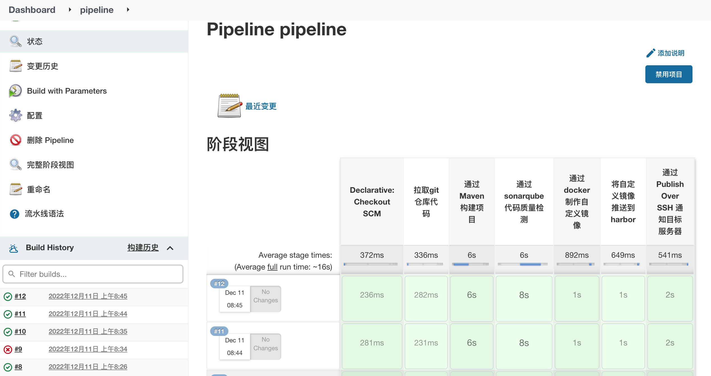

# Jenkins Pipeline

## pipeline文件
1. 模版文件
```text
//所有的脚本命令都放在pipeline中
pipeline {
    //指定任务在哪个集群节点中执行
    agent any

    //声明全局变量，方便后面使用
    environment {
        key = 'value'
    }
    stages {
        stage('拉取git仓库代码') {
            steps {
                echo '拉取git仓库代码 -success'
            }
        }
        stage('通过Maven构建项目') {
            steps {
                echo '通过Maven构建项目 -success'
            }
        }
        stage('通过sonarqube代码质量检测') {
            steps {
                echo '通过sonarqube做代码质量检测 -success'
            }
        }
        stage('通过docker制作自定义镜像') {
            steps {
                echo '通过docker制作自定义镜像 -success'
            }
        }
        stage('将自定义镜像推送到harbor') {
            steps {
                echo '将自定义镜像推送到harbor -success'
            }
        }
        stage('通过Publish Over SSH 通知目标服务器') {
            steps {
                echo '通过Publish Over SSH 通知目标服务器 -success'
            }
        }
    }
}

```
2. pipeline运行文件最终确定
```pipeline
//所有的脚本命令都放在pipeline中
pipeline {
    //指定任务在哪个集群节点中执行
    agent any

    //声明全局变量，方便后面使用
    environment {
        harborUser = 'admin'
        harborPasswd = 'Harbor12345'
        harborAddress = '192.168.3.102:80'
        harborRepo = 'repo'
    }
    stages {
        stage('拉取git仓库代码') {
            steps {
               checkout([$class: 'GitSCM', branches: [[name: '${tag}']], extensions: [], userRemoteConfigs: [[url: 'http://192.168.3.101:8929/root/mytest.git']]])
            }
        }
        stage('通过Maven构建项目') {
            steps {
                sh '/var/jenkins_home/maven/bin/mvn clean package -DskipTests'
            }
        }
        stage('通过sonarqube代码质量检测') {
            steps {
                sh '/var/jenkins_home/sonar-scanner/bin/sonar-scanner -Dsonar.source./ -Dsonar.projectname=${JOB_NAME}  -Dsonar.projectKey=${JOB_NAME} -Dsonar.java.binaries=./target/ -Dsonar.login=dbe6ce0f6af2d435caa8dda466759b5f9df9a79a'
            }
        }
        stage('通过docker制作自定义镜像') {
            steps {
                sh '''mv ./target/*.jar ./docker/
                docker build -t ${JOB_NAME}:${tag} ./docker/'''
            }
        }
        stage('将自定义镜像推送到harbor') {
            steps {
                sh '''docker login -u ${harborUser} -p ${harborPasswd} ${harborAddress}
                docker tag ${JOB_NAME}:${tag} ${harborAddress}/${harborRepo}/${JOB_NAME}:${tag}
                docker push ${harborAddress}/${harborRepo}/${JOB_NAME}:${tag}'''
            }
        }
        stage('通过Publish Over SSH 通知目标服务器') {
            steps {
                sshPublisher(publishers: [sshPublisherDesc(configName: 'test', transfers: [sshTransfer(cleanRemote: false, excludes: '', execCommand: "deploy.sh $harborAddress $harborRepo $JOB_NAME $tag $host_port", execTimeout: 120000, flatten: false, makeEmptyDirs: false, noDefaultExcludes: false, patternSeparator: '[, ]+', remoteDirectory: '', remoteDirectorySDF: false, removePrefix: '', sourceFiles: '')], usePromotionTimestamp: false, useWorkspaceInPromotion: false, verbose: false)])
            }
        }
    }
}
```
