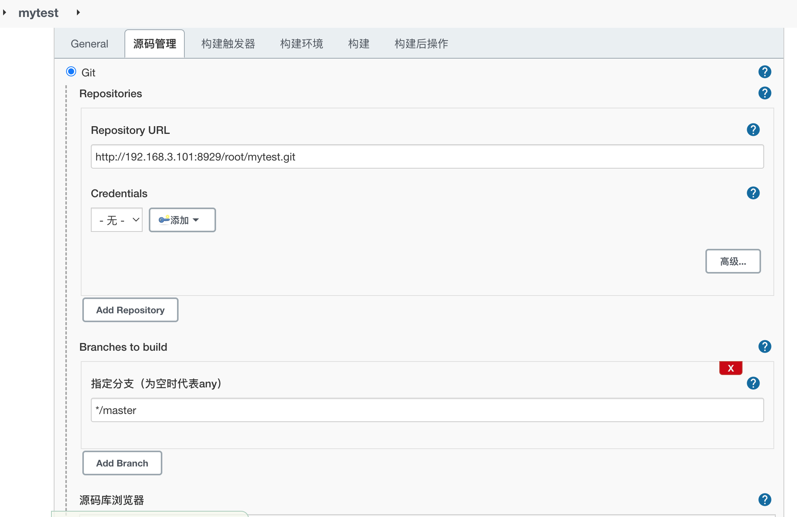
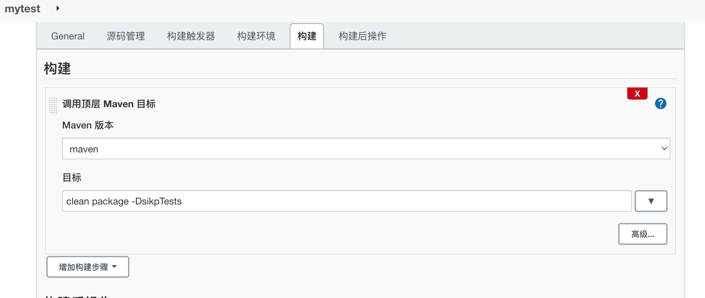
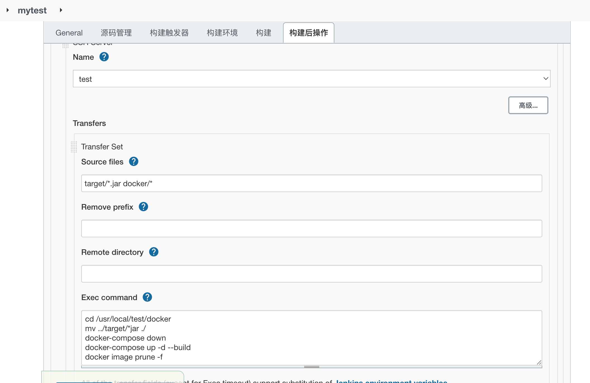
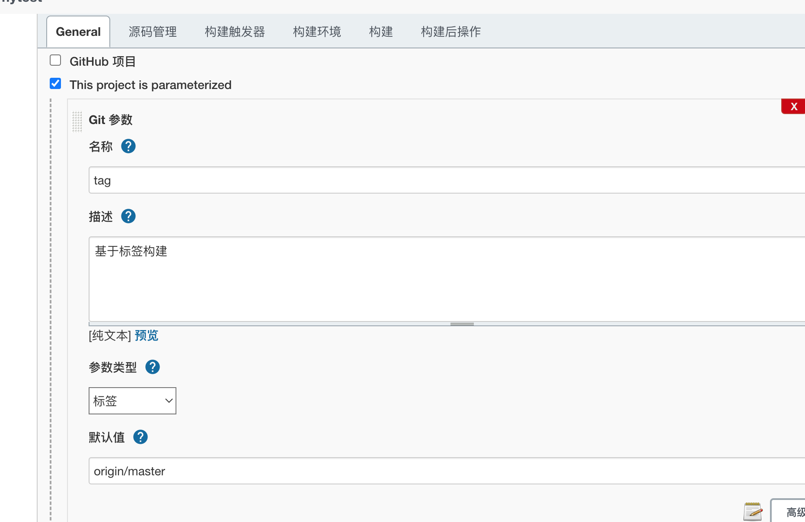
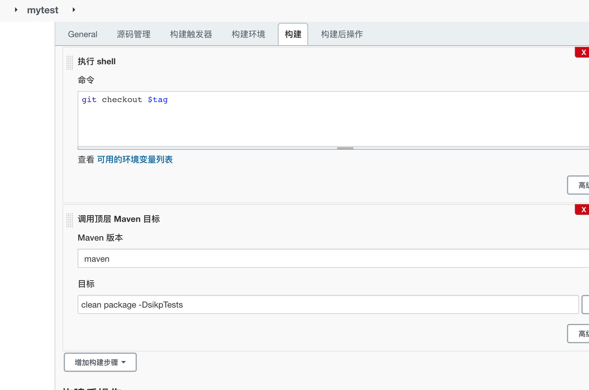
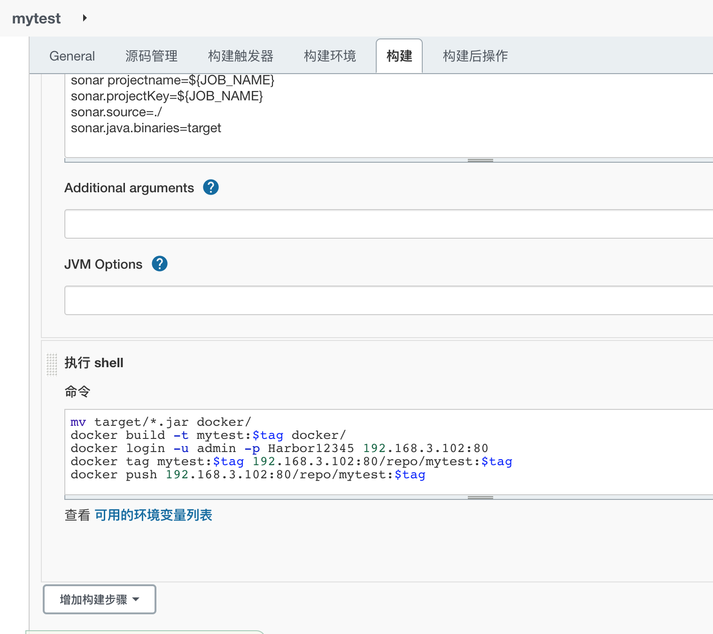
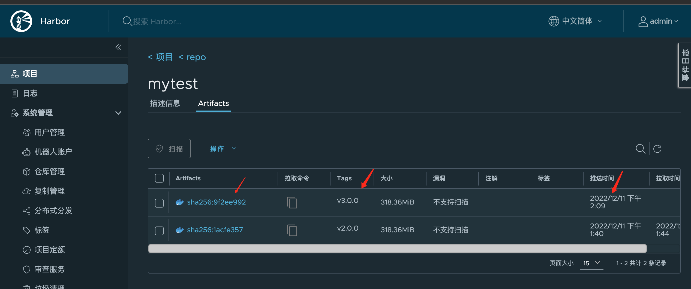

# Jenkins安装

## docker-compose启动Jenkins

编辑docker-compose yaml文件
```yaml
version: "3.1"
services:
  jenkins:
    image: jenkins/jenkins:2.319.1-lts
    container_name: jenkins
    ports:
      - 8080:8080
      - 50000:50000
    volumes:
       - ./data/:/var/jenkins_home/
```

## 报错信息查看
```bash
[root@jenkins jenkins_docker]# docker logs -f jenkins
touch: cannot touch '/var/jenkins_home/copy_reference_file.log': Permission denied
Can not write to /var/jenkins_home/copy_reference_file.log. Wrong volume permissions?

## 解决办法
chmod 777 -R data
```
再次重启docker-compose
```bash
[root@jenkins jenkins_docker]# docker-compose restart
```
正常启动的信息
```text
*************************************************************
*************************************************************
*************************************************************

Jenkins initial setup is required. An admin user has been created and a password generated.
Please use the following password to proceed to installation:

0608dd6f8e59411a927a4fe26a0c66d7

This may also be found at: /var/jenkins_home/secrets/initialAdminPassword

*************************************************************
*************************************************************
*************************************************************
```
##  如果Jenkins下载插件耗时太长

使用如下网址去找对应的插件，并且下载下来放到对应Jenkins插件目录
```url
https://plugins.jenkins.io/
```

## Jenkins配置简单项目
1. 配置git

2. 配置构建操作

3. 配置构建完成之后的操作

4. 参数化构建



## Jenkins内部需要能操作宿主机docker命令
```bash
[root@jenkins jenkins_docker]# cd /var/run/
[root@jenkins run]# chown root:root docker.sock
[root@jenkins run]# chmod o+rw docker.sock

修改docker-compose.yml文件

version: "3.1"
services:
  jenkins:
    image: jenkins/jenkins:2.319.1-lts
    container_name: jenkins
    ports:
      - 8080:8080
      - 50000:50000
    volumes:
       - ./data/:/var/jenkins_home/
       - /var/run/docker.sock:/var/run/docker.sock
       - /usr/bin/docker:/usr/bin/docker
       - /etc/docker/daemon.json:/etc/docker/daemon.json

[root@jenkins jenkins_docker]# docker-compose up -d
Recreating jenkins ... done

重新启动Jenkins

验证Jenkins容器内部docker命令
[root@jenkins jenkins_docker]# docker exec -it jenkins bash
jenkins@372dcc596026:/$ docker version
Client: Docker Engine - Community
 Version:           20.10.21
 API version:       1.41
 Go version:        go1.18.7
 Git commit:        baeda1f
 Built:             Tue Oct 25 18:04:24 2022
 OS/Arch:           linux/amd64
 Context:           default
 Experimental:      true

Server: Docker Engine - Community
 Engine:
  Version:          20.10.21
  API version:      1.41 (minimum version 1.12)
  Go version:       go1.18.7
  Git commit:       3056208
  Built:            Tue Oct 25 18:02:38 2022
  OS/Arch:          linux/amd64
  Experimental:     false
 containerd:
  Version:          1.6.12
  GitCommit:        a05d175400b1145e5e6a735a6710579d181e7fb0
 runc:
  Version:          1.1.4
  GitCommit:        v1.1.4-0-g5fd4c4d
 docker-init:
  Version:          0.19.0
  GitCommit:        de40ad0

说明容器内能成功运行docker命令
```
## Jenkins推送镜像到harbor
1. 修改流水线脚本

2. 推送成功harbor管理后台查看


## 脚本处理harbor镜像拉取和启动
```bash
[root@jenkins ~]# cat deploy.sh
source ~/.bash_profile
harbor_url=$1
harbor_project_name=$2
project_name=$3
tag=$4
port=$5

imageName=$harbor_url/$harbor_project_name/$project_name:$tag

containerId=`docker ps -a | grep ${project_name} | awk '{print $1}'`
if [ "$containerId" != "" ] ; then
    docker stop $containerId
    docker rm $containerId
    echo "Delete Container Success"
fi

imageId=`docker images | grep ${project_name} | awk '{print $3}'`

if [ "$imageId" != "" ] ; then
    docker rmi -f $imageId
    echo "Delete Image Success"
fi

docker login -u admin -p Harbor12345 $harbor_url

docker pull $imageName

docker run -d -p $port:8080 --name $project_name $imageName

echo "Start Container Success"
echo $project_name

./deploy.sh 192.168.3.102:80 repo mytest v3.0.0 8081
```

## 删除无效的images
```shell
[root@jenkins jenkins_docker]# docker images
REPOSITORY                       TAG               IMAGE ID       CREATED         SIZE
golang                           1.18.10           c37a56a6d654   7 days ago      965MB
192.168.3.102:80/repo/pipeline   v3.0.0            7ea40d6e08ff   5 weeks ago     833MB
<none>                           <none>            dbceffc14669   5 weeks ago     833MB
<none>                           <none>            969618824db2   5 weeks ago     833MB
192.168.3.102:80/repo/mytest     v3.0.0            d0d7a432c6b1   5 weeks ago     833MB
postgres                         latest            4c6b3cc10e6b   6 weeks ago     379MB
sonarqube                        8.9.6-community   3f623568fa64   13 months ago   497MB
jenkins/jenkins                  2.319.1-lts       2a4bbe50c40b   13 months ago   441MB
goharbor/harbor-exporter         v2.3.4            41f7fb260d0d   14 months ago   81.1MB
goharbor/chartmuseum-photon      v2.3.4            f460981da720   14 months ago   179MB

```

* 使用命令 `docker image prune -f`
