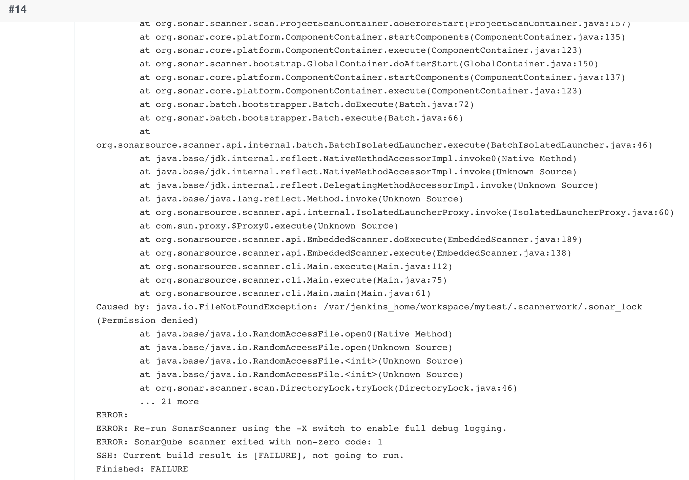

# sonarqube

## 安装sonarqube
1. pull images 拉取镜像
```bash
docker pull postgres
docker pull sonarqube:8.9.6-community

[root@jenkins docker]# docker images
REPOSITORY                 TAG               IMAGE ID       CREATED          SIZE
mytest                     v2.0.1            0acb5da9428b   39 minutes ago   833MB
mytest                     v2.0.0            3e1b984404e3   42 minutes ago   833MB
mytest                     latest            ff48859718bb   43 minutes ago   833MB
postgres                   latest            4c6b3cc10e6b   3 days ago       379MB
sonarqube                  8.9.6-community   3f623568fa64   11 months ago    497MB
jenkins/jenkins            2.319.1-lts       2a4bbe50c40b   12 months ago    441MB
daocloud.io/library/java   8u40-jdk          4aefdb29fd43   7 years ago      816MB
```
2. 生成docker-compose yml文件

* vi /usr/local/docker/sonarqube_docker/docker-compose.yml
```yaml
version: '3.1'
services:
  db:
    image: postgres
    container_name: db
    ports:
      - 5432:5432
    networks:
      - sonarnet
    environment:
      POSTGRES_USER: sonar
      POSTGRES_PASSWORD: sonar
  sonarqube:
    image: sonarqube:8.9.6-community
    container_name: sonarqube
    depends_on:
      - db
    ports:
      - 9000:9000
    networks:
      - sonarnet
    environment:
      SONAR_JDBC_URL: jdbc:postgresql://db:5432/sonar
      SONAR_JDBC_USERNAME: sonar
      SONAR_JDBC_PASSWORD: sonar
networks:
  sonarnet:
    driver: bridge
```
* docker-compose up -d 
```bash
[root@jenkins sonarqube_docker]# docker-compose up -d
Creating network "sonarqube_docker_sonarnet" with driver "bridge"
Creating db ... done
Creating sonarqube ... done
```
3. 查看sonarqube启动日志
```bash
[root@jenkins sonarqube_docker]# docker logs -f sonarqube
2022.12.10 08:16:01 INFO  es[][o.e.t.TransportService] publish_address {127.0.0.1:40075}, bound_addresses {127.0.0.1:40075}
2022.12.10 08:16:01 INFO  es[][o.e.b.BootstrapChecks] explicitly enforcing bootstrap checks

ERROR: [1] bootstrap checks failed. You must address the points described in the following [1] lines before starting Elasticsearch.
bootstrap check failure [1] of [1]: max virtual memory areas vm.max_map_count [65530] is too low, increase to at least [262144]
ERROR: Elasticsearch did not exit normally - check the logs at /opt/sonarqube/logs/sonarqube.log
2022.12.10 08:16:01 INFO  es[][o.e.n.Node] stopping ...
2022.12.10 08:16:01 INFO  es[][o.e.n.Node] stopped
2022.12.10 08:16:01 INFO  es[][o.e.n.Node] closing ...
2022.12.10 08:16:01 INFO  es[][o.e.n.Node] closed
2022.12.10 08:16:01 WARN  app[][o.s.a.p.AbstractManagedProcess] Process exited with exit value [es]: 78
2022.12.10 08:16:01 INFO  app[][o.s.a.SchedulerImpl] Process[es] is stopped
2022.12.10 08:16:01 INFO  app[][o.s.a.SchedulerImpl] SonarQube is stopped
```

4. 修改虚拟内存大小
```bash
[root@jenkins sonarqube_docker]# vim /etc/sysctl.conf
[root@jenkins sonarqube_docker]# sysctl -p
vm.max_map_count = 262144
[root@jenkins sonarqube_docker]# docker-compose up -d
db is up-to-date
Starting sonarqube ... done

2022.12.10 08:28:31 INFO  ce[][o.s.c.c.CePluginRepository] Load plugins
2022.12.10 08:28:31 INFO  ce[][o.s.c.p.PluginInfo] Plugin [l10nzh] defines 'l10nen' as base plugin. This metadata can be removed from manifest of l10n plugins since version 5.2.
2022.12.10 08:28:33 INFO  ce[][o.s.c.c.ComputeEngineContainerImpl] Running Community edition
2022.12.10 08:28:33 INFO  ce[][o.s.ce.app.CeServer] Compute Engine is operational
2022.12.10 08:28:33 INFO  app[][o.s.a.SchedulerImpl] Process[ce] is up
2022.12.10 08:28:33 INFO  app[][o.s.a.SchedulerImpl] SonarQube is up
```

5. 登录sonarqube
```bash
初始用户名和密码都是admin
登录进去需要修改密码
http://192.168.3.102:9000/projects
```
6. maven settings.xml 配置sonarqube
```xml
<profile>
       <id>sonar</id>
       <activation>
        <activeByDefault>true</activeByDefault>
       </activation>
       <properties>
        <sonar.login>admin</sonar.login>
        <sonar.password>111111</sonar.password>
        <sonar.host.url>http://192.168.3.102:9000</sonar.host.url>
       </properties>
     </profile>
```
7. 本地springboot项目编译直接sonarqube扫码代码
```bash
mvn sonar:sonar
```


8. sonar-scanner
```url
https://docs.sonarqube.org/latest/analyzing-source-code/scanners/sonarscanner/
```
选择版本下载


* 使用sonar-scanner命令行扫描代码
```bash
/usr/local/docker/jenkins_docker/data/sonar-scanner/bin/sonar-scanner -Dsoanr.source=./ -Dsonar.projectname=linux-test

INFO: Scanner configuration file: /usr/local/docker/jenkins_docker/data/sonar-scanner/conf/sonar-scanner.properties
INFO: Project root configuration file: NONE
INFO: SonarScanner 4.6.1.2450
INFO: Java 11.0.3 AdoptOpenJDK (64-bit)
INFO: Linux 3.10.0-1127.el7.x86_64 amd64
INFO: User cache: /root/.sonar/cache
INFO: Scanner configuration file: /usr/local/docker/jenkins_docker/data/sonar-scanner/conf/sonar-scanner.properties
INFO: Project root configuration file: NONE
INFO: Analyzing on SonarQube server 8.9.6
INFO: Default locale: "en_US", source code encoding: "UTF-8"
INFO: Load global settings
INFO: ------------------------------------------------------------------------
INFO: EXECUTION FAILURE
INFO: ------------------------------------------------------------------------
INFO: Total time: 1.251s
INFO: Final Memory: 4M/17M
INFO: ------------------------------------------------------------------------
ERROR: Error during SonarScanner execution
ERROR: Not authorized. Analyzing this project requires authentication. Please provide a user token in sonar.login or other credentials in sonar.login and sonar.password.
ERROR:
ERROR: Re-run SonarScanner using the -X switch to enable full debug logging.
```
报错，是因为账号授权的问题，sonar管理台生成账号授权码
```bash
/usr/local/docker/jenkins_docker/data/sonar-scanner/bin/sonar-scanner -Dsoanr.source=./ -Dsonar.projectname=linux-test -Dsonar.login=dbe6ce0f6af2d435caa8dda466759b5f9df9a79a -Dsonar.projectKey=linux-test -Dsonar.java.binaries=./target/
```
最终成功运行


9. jenkins集合sonar-scanner


- 启动运行报错



- 根据报错提示处理文件夹，这是因为上面步骤手动执行scanner生成的目录权限是root，所以需要删除
```bash
[root@jenkins mytest]# ll -a
total 8
drwxr-xr-x. 7 1000 1000  110 Dec 10 22:33 .
drwxr-xr-x. 3 1000 1000   20 Dec 10 00:53 ..
drwxr-xr-x. 2 1000 1000   50 Dec 10 02:27 docker
drwxr-xr-x. 8 1000 1000  162 Dec 10 22:33 .git
-rw-r--r--. 1 1000 1000   13 Dec 10 00:53 .gitignore
-rw-r--r--. 1 1000 1000 1471 Dec 10 01:36 pom.xml
drwxr-xr-x. 2 root root   48 Dec 10 21:50 .scannerwork
drwxr-xr-x. 3 1000 1000   18 Dec 10 22:33 src
drwxr-xr-x. 6 1000 1000  133 Dec 10 22:33 target
[root@jenkins mytest]# rm -rf .scannerwork/
```
- 删除之后重新启动Jenkins任务，执行成功


