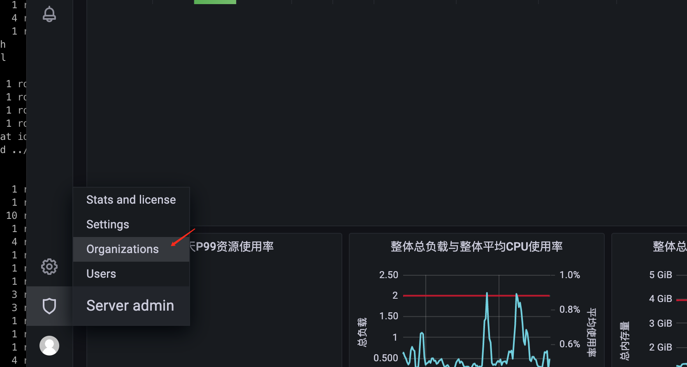
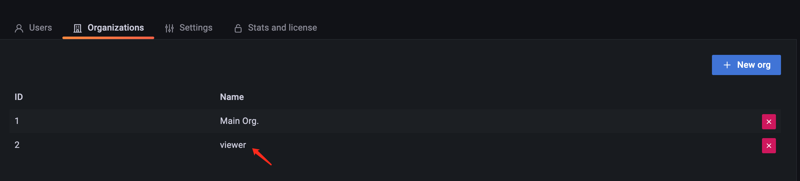
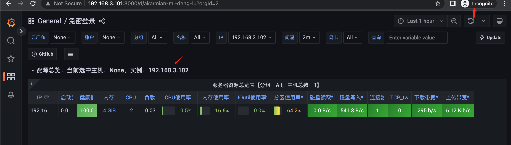

# docker安装grafana

## 先启动一个grafana
```shell
docker run -d --name grafana \
-p 3000:3000 \
grafana/grafana:latest
```
## 复制启动成功的grafana信息
```shell
docker cp grafana:/etc/grafana/ .
docker cp grafana:/var/lib/grafana .
```


# grafana 开启免密登录获取dashboard

## 第一步grafana增加一个org



## 第二步修改配置文件


```conf
 474 #################################### Anonymous Auth ######################
 475 [auth.anonymous]
 476 # enable anonymous access
 477 enabled = true
 478
 479 # specify organization name that should be used for unauthenticated users
 480 org_name = viewer
 481
 482 # specify role for unauthenticated users
 483 org_role = Viewer
 484
 485 # mask the Grafana version number for unauthenticated users
 486 ;hide_version = false
```

## docker-compose restart
* ➜  grafana-docker cat docker-compose.yml

```yaml
version: '3.7'
services:
   grafana:
      image: grafana/grafana:latest
      container_name: grafana
      restart: on-failure:1
      ports:
         - "3000:3000"
      volumes:
         - ./grafana/:/etc/grafana/
         - ./grafana/:/var/lib/grafana/
      deploy:
         resources:
            limits:
               cpus: '0.50'
               memory: 2G
```

* `docker-compose restart`
  
## 验证免密登录
* 开启一个无痕浏览器验证免密登录获取dashboard

