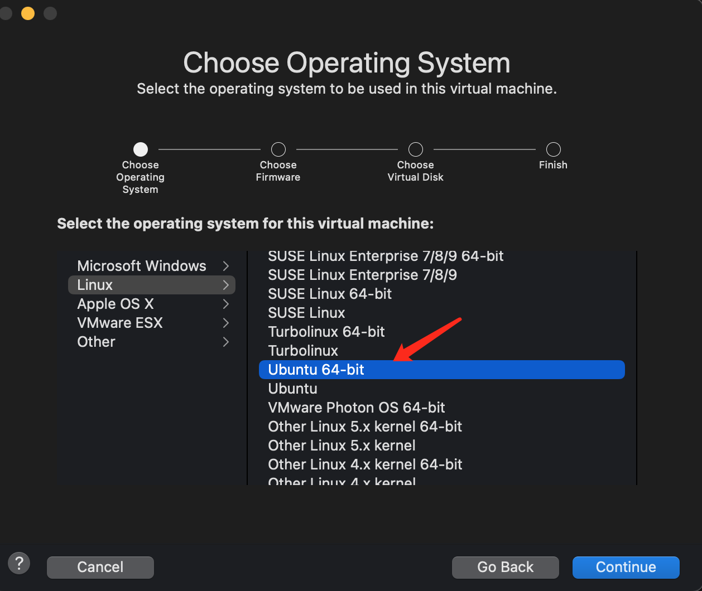
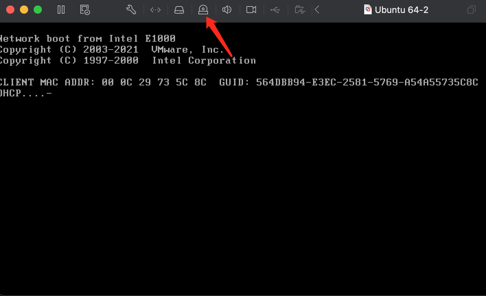
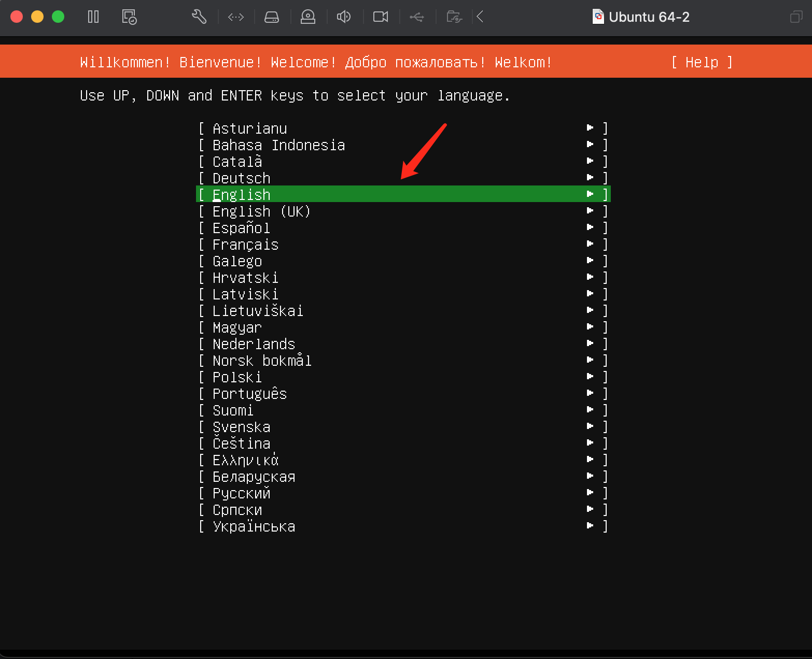
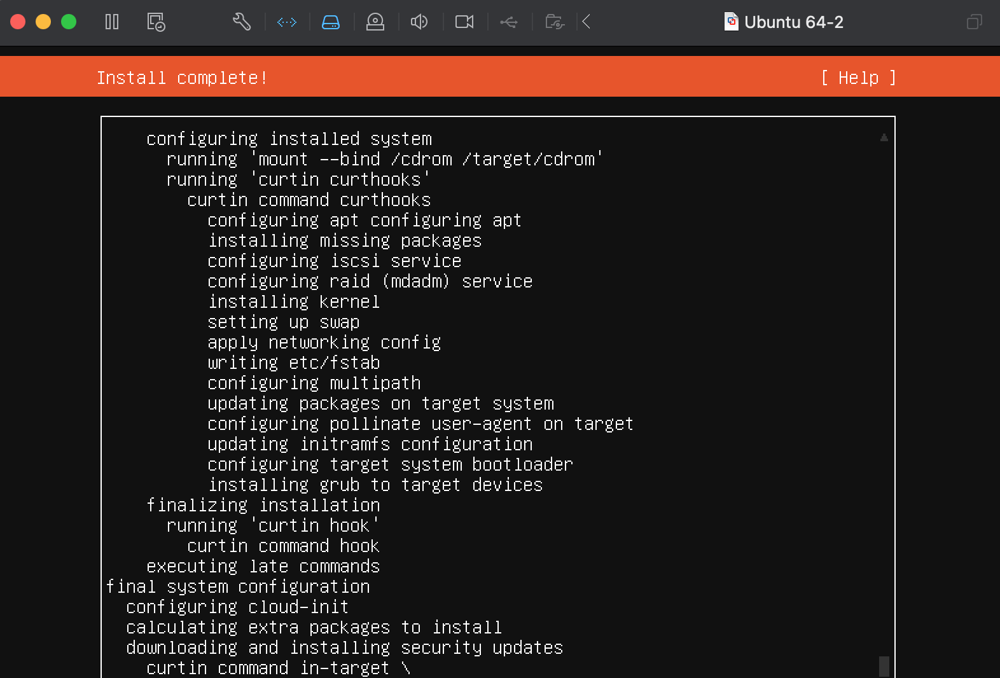
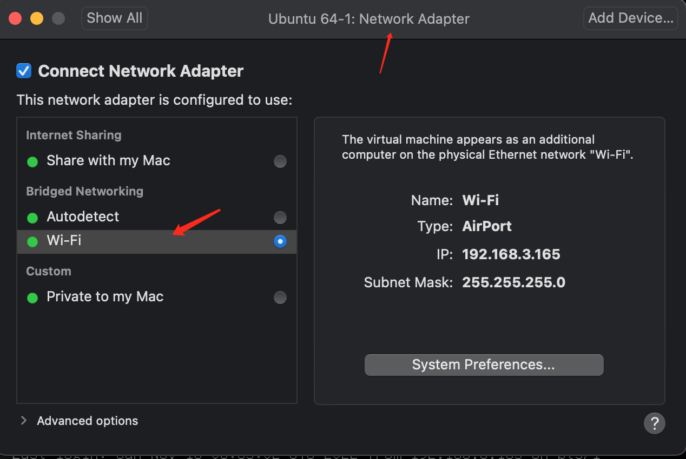

## VMware 安装 Ubuntu

### 镜像下载

https://releases.ubuntu.com/20.04.5/ubuntu-20.04.5-live-server-amd64.iso

### 安装

1. 第一步选择创建虚拟机
   

2. 第二步选择镜像，并且 connect CD
   

3. 第三步选择必要的信息安装
   

> Ubuntu 的安装比 centOS 安装简洁明了，虽然都是命令行，反倒能看懂每一步，光标的选择都清晰明了

4. 安装完成提示
   

### 登录并且设置环境

1. 第一次登录进来设置 root 密码

```text
步骤1：

给root用户设置密码：

命令：sudo passwd root

输入密码，并确认密码。

步骤2：

重新输入命令：su root

然后输入密码：

发现可以切换到root权限了。

步骤3：

使用su xyx命令，切换到普通用户。
```

2. 第二步修改网络为桥接形式
   

3. 修改 Ubuntu 网络配置
   username@root:~$ cat /etc/netplan/00-installer-config.yaml

```yaml
# This is the network config written by 'subiquity'
network:
  ethernets:
    ens33:
      dhcp4: no
      addresses:
        - 192.168.3.175/24
      gateway4: 192.168.3.1
      nameservers:
        addresses: [192.168.3.1]
  version: 2
```

4. 执行`netplan apply`

```shell
## 查看网络IP地址
root@root:~# ip addr
1: lo: <LOOPBACK,UP,LOWER_UP> mtu 65536 qdisc noqueue state UNKNOWN group default qlen 1000
    link/loopback 00:00:00:00:00:00 brd 00:00:00:00:00:00
    inet 127.0.0.1/8 scope host lo
       valid_lft forever preferred_lft forever
    inet6 ::1/128 scope host
       valid_lft forever preferred_lft forever
2: ens33: <BROADCAST,MULTICAST,UP,LOWER_UP> mtu 1500 qdisc fq_codel state UP group default qlen 1000
    link/ether 00:0c:29:c8:c7:22 brd ff:ff:ff:ff:ff:ff
    inet 192.168.3.175/24 brd 192.168.3.255 scope global ens33
       valid_lft forever preferred_lft forever
    inet6 fe80::20c:29ff:fec8:c722/64 scope link
       valid_lft forever preferred_lft forever
```

5. 安装 ssh

```shell
apt-get install sshd
```

6. itemr2 远程登录机器

```shell
➜  sshremote ./ubuntu2.sh
The authenticity of host '192.168.3.176 (192.168.3.176)' can't be established.
ED25519 key fingerprint is SHA256:DnaShQsVcibLnw36fiDXc9atJKZcgeJJGHkiH2mtzMI.
This key is not known by any other names
Are you sure you want to continue connecting (yes/no/[fingerprint])? yes
Warning: Permanently added '192.168.3.176' (ED25519) to the list of known hosts.
username@192.168.3.176's password:

➜  sshremote vim ubuntu2.sh
➜  sshremote ./ubuntu2.sh
test@192.168.3.176's password:
Welcome to Ubuntu 20.04.5 LTS (GNU/Linux 5.4.0-131-generic x86_64)
```

7. 添加免密登录公钥

```shell
test@test:~/.ssh$ vim authorized_keys
test@test:~/.ssh$ ll
total 12
drwx------ 2 test test 4096 Nov 13 12:52 ./
drwxr-xr-x 4 test test 4096 Nov 13 12:52 ../
-rw------- 1 test test  569 Nov 13 12:52 authorized_keys
```

8. 再次校验免密登录
